# Patches

**Terminal-native social media.** Chronological, open-source, no ranking algorithm, no
infinite-scroll tricks, no ads, no votes or karma. A feed sorted by time, always — the server
gives you your social world, the client decides how to arrange it.

[](https://github.com/alliecatowo/patches/actions/workflows/ci.yml)
[](https://github.com/alliecatowo/patches/actions/workflows/deploy.yml)
[](https://github.com/alliecatowo/patches/actions/workflows/web.yml)
[](LICENSE)
[](mise.toml)
[](mise.toml)

People, posts, and image attachments; replies, reposts, and quotes; tags and communities;
flair and pinned posts; a personal terminal "Page" for every actor; and a small, real
federation lab. The first-class client is a terminal app built with Ink/React; a responsive
web client is a full peer, not an afterthought.

<p>
  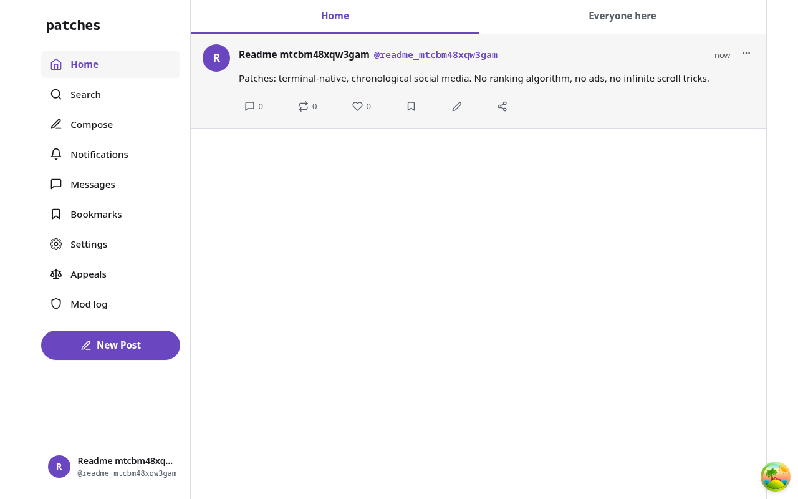
  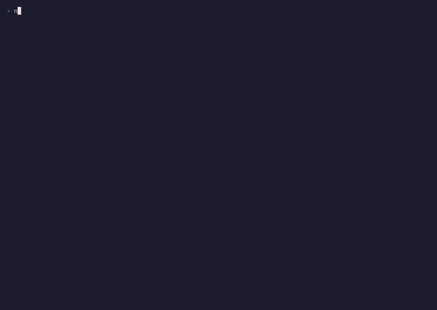
</p>

## What works today

- **The core social loop is live** on `patches-social.fly.dev`: register/login (password or
  SSH key), post, reply, like, bookmark, follow, home/local feeds, notifications, and image
  attachments (Kitty graphics protocol with a plain-text fallback elsewhere).
- **Social depth (Amendment B) is implemented**: reposts and quotes, tags, communities, flair,
  ≤3 pinned posts, per-actor Pages with a guestbook, profile walls, and edit history.
- **Privacy, filters, and decentralized moderation (Amendment C) are implemented**: blocking,
  muting, reporting, filter lists, labelers, and moderator/owner enforcement tooling
  (`patches-admin`).
- **The web client (`apps/web`) is a full responsive peer**, not a cut-down mirror: theming,
  PWA install + app badging, profile wall editing, and the same chronological/no-scores rules
  as the TUI.
- **Direct messages do not work yet.** The protocol (per-device identity, session setup,
  message fanout) is implemented and integration-tested, but two real accounts still cannot
  complete a session handshake with each other (tracked as B-124 in
  [`tasks.md`](tasks.md)). v0 DMs are **server-visible**, not encrypted, secure, or private —
  see "Messaging (E2EE — in progress)" below.
- **Federation is a local two-node lab only** (`mise run fed:lab`); the flagship node does not
  federate with the outside world yet.

For the full phase-by-phase status, see [`docs/product/roadmap.md`](docs/product/roadmap.md).

## Try the live node

Two hosted surfaces sit in front of the flagship node: [patches-web.pages.dev](https://patches-web.pages.dev)
is the responsive browser GUI (`apps/web`), talking to `patches-social.fly.dev` over Connect;
and [patches-site.pages.dev](https://patches-site.pages.dev) is the docs/marketing site
(`site/`, VitePress).

Or install the terminal client. Check
[github.com/alliecatowo/patches/releases](https://github.com/alliecatowo/patches/releases) for
the newest release tag and asset name, then:

```bash
npm install --global --allow-remote=all https://github.com/alliecatowo/patches/releases/download/<tag>/<asset>.tgz
# e.g. .../download/v0.1.0-alpha.3/patches-social-0.1.0-alpha.3.tgz
# npm 12 blocks remote tarballs by default: keep --allow-remote=all, or download the .tgz and install the local file

patches register --handle you --display-name "You" --email you@example.com --invite <code>
patches                 # opens the full-screen TUI, connected to patches-social.fly.dev by default
patches --help           # every subcommand (login, whoami, keys, verify, ...)
```

A `curl | sh` installer, an npm registry package, and Homebrew are planned (`tasks.md` B-138)
but not live yet — the release-tarball install above is the only supported path today. Full
walkthrough, including how to drive two accounts side by side to see follow/reply/notify in
action: [`docs/operations/try-it.md`](docs/operations/try-it.md).

The live node is invite-only — ask Allie for a code, or run the whole stack locally (below) and
invite yourself.

<details>
<summary><strong>Terminal client (TUI)</strong></summary>

Built with Ink 7 (React for the terminal). Kitty/Ghostty-class terminals get inline image
attachments via the Kitty graphics protocol; every other terminal falls back to plain text —
the TUI never assumes graphics support.

<p>
  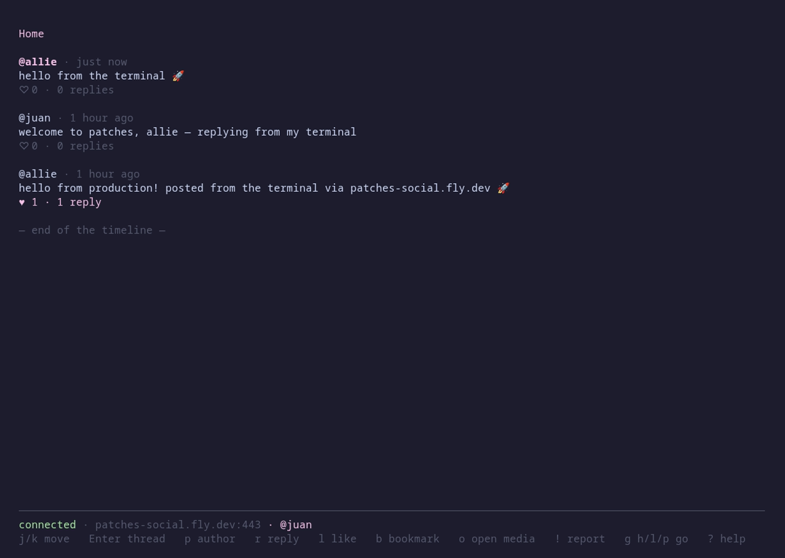
  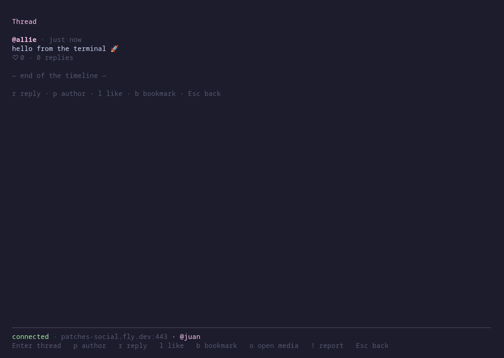
  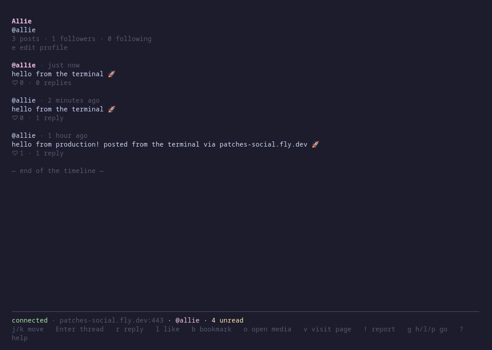
</p>
<p>
  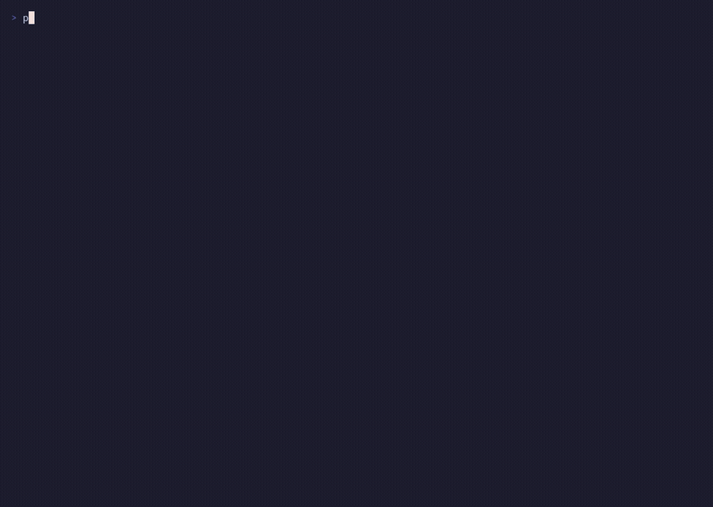
  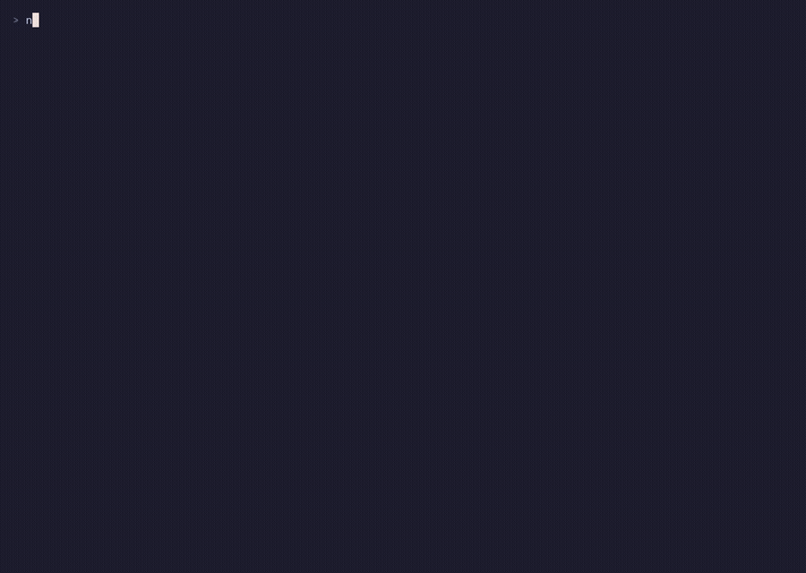
</p>

The screenshots above are VHS-scripted recordings against the live node (`mise run demos`,
`infra/demos/`). For a source-of-truth view of
exactly what the TUI renders today — the same byte-for-byte fixtures CI diffs on every pull
request — see [`docs/media/tui/frames.md`](docs/media/tui/frames.md), generated from
`apps/tui/test/golden/*.txt` by `mise run screenshots:tui` (there is no PNG/SVG renderer for
Ink frames in this repo, and this project doesn't add a dependency just to make one — see
[Regenerating this media](#regenerating-this-media)).

More: [`docs/user-guide.md`](docs/user-guide.md) (keybindings, connecting to a node),
[`docs/architecture/tui.md`](docs/architecture/tui.md) (what's built).

</details>

<details>
<summary><strong>Web PWA</strong></summary>

`apps/web` (Vite + React 19 + Connect-Web) is a full responsive peer of the TUI, not a
read-only mirror: the same chronological feed, no engagement ranking, no scores. It installs
as a PWA (manifest, app badging for unread counts, mobile safe-area insets) and supports
light/dark/custom themes, profile wall editing, and followers/following screens.

Desktop (1280×800) and mobile (390×844) captures, generated from the lab harness by
`apps/web/e2e/readme-screenshots.spec.ts` — see [Regenerating this media](#regenerating-this-media):

<p>
  
  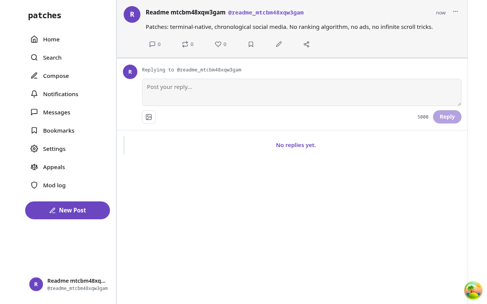
</p>
<p>
  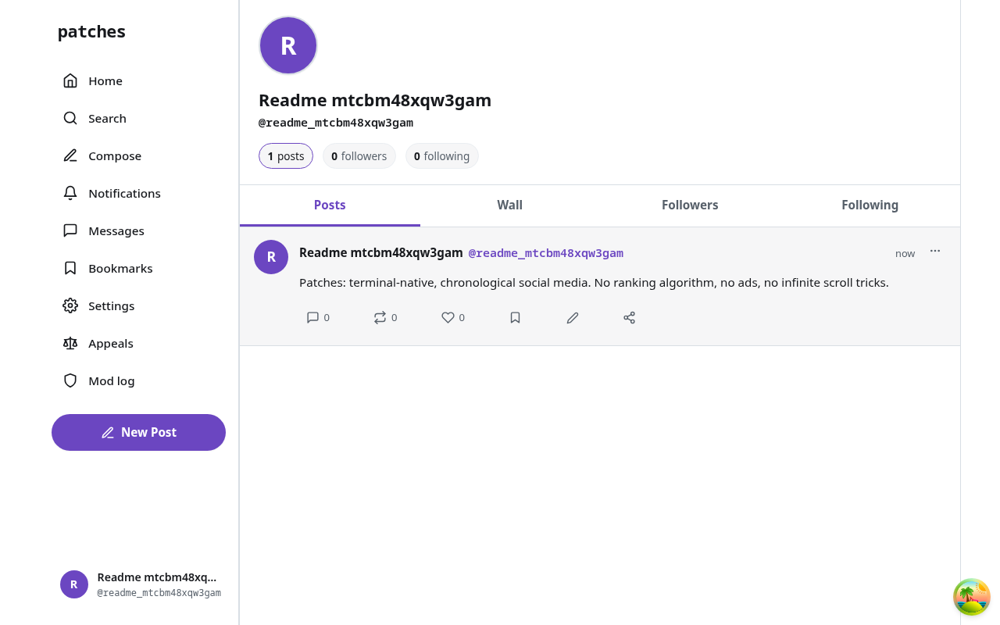
  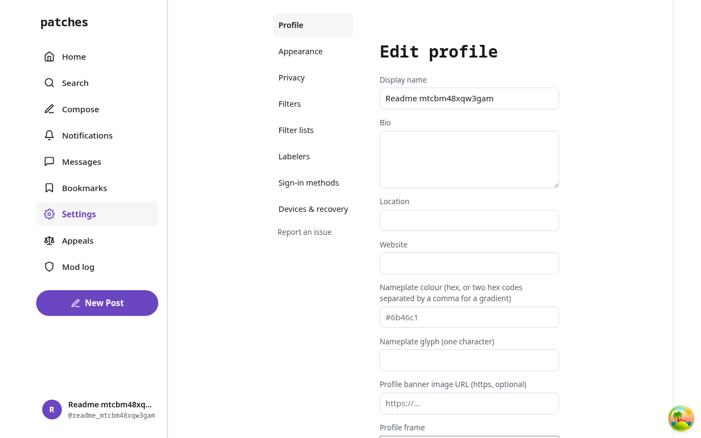
  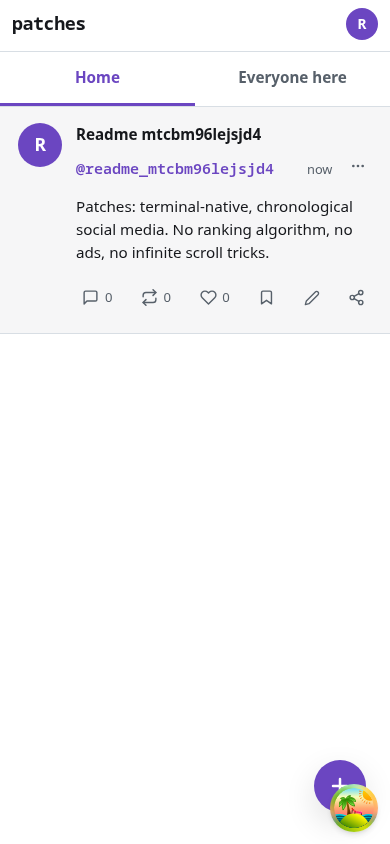
  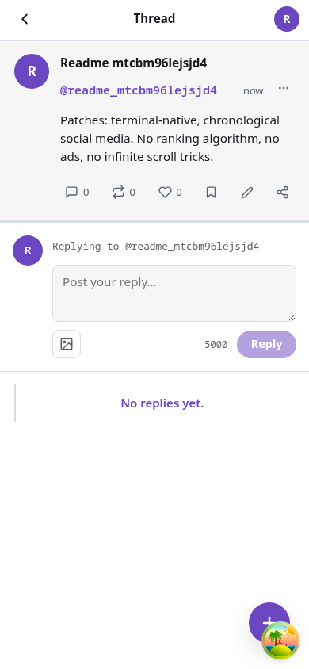
  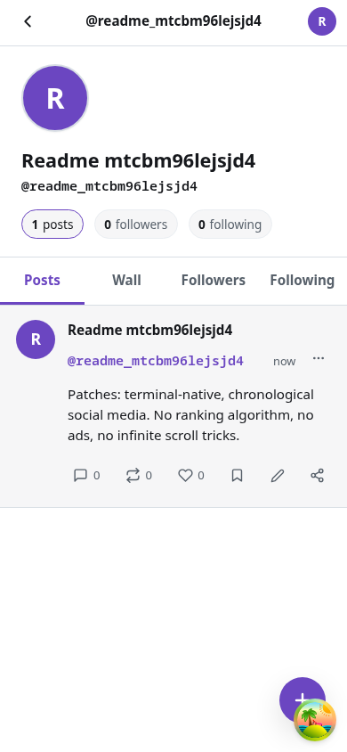
  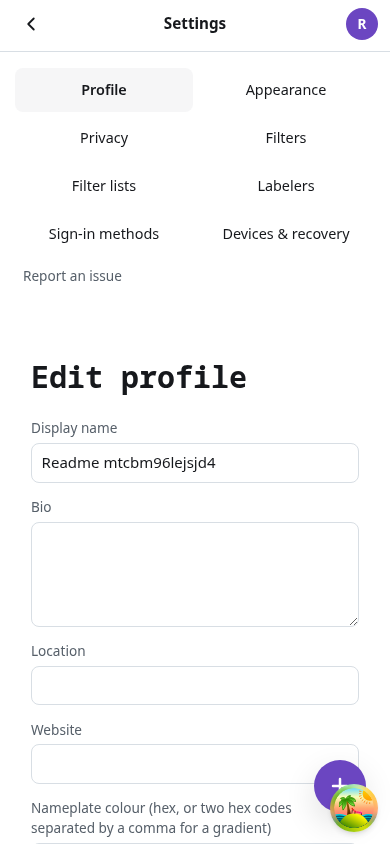
</p>

More: [`docs/operations/web.md`](docs/operations/web.md), [`apps/web/README.md`](apps/web/README.md).

</details>

<details>
<summary><strong>Messaging (E2EE — in progress)</strong></summary>

<p>
  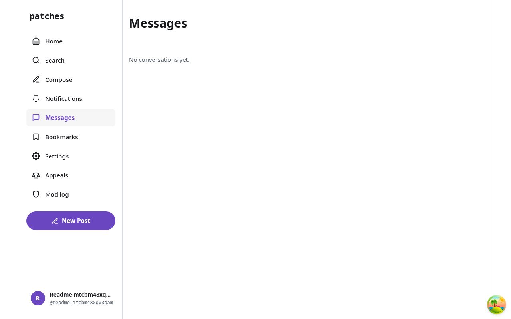
  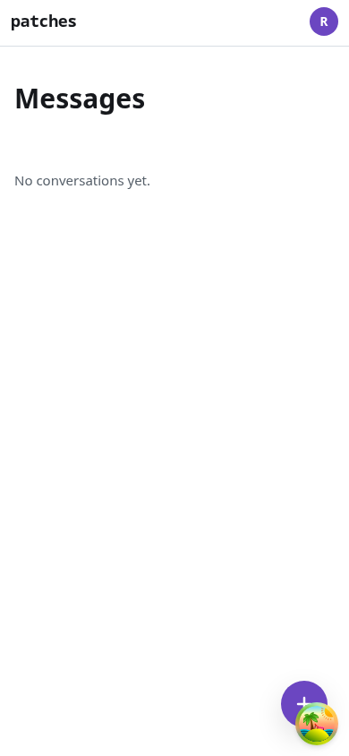
</p>

**v0 direct messages are server-visible, never encrypted, secure, or private** — this project
never calls them otherwise (spec §183.1, CLAUDE.md Amendment B). The real end-to-end-encrypted
protocol (per-device identity, X3DH-class session setup, Signal-style Double Ratchet with
encrypted headers, franking for abuse reports) is designed and largely built —
[`docs/architecture/e2ee.md`](docs/architecture/e2ee.md) documents the actual, current state —
but two real accounts cannot yet complete a session handshake with each other end to end
(blocked on B-124, a client identity-transcript unification, tracked in
[`tasks.md`](tasks.md)). No client, live or local, can currently send a working DM. When this
ships, it will be described specifically (protocol name, what it protects, what the node can
still see), never as a generic "secure messaging" claim.

</details>

<details>
<summary><strong>Federation seam</strong></summary>

Federation is a seam, not a feature yet: `FederationGateway` → `NoopFederationGateway` in v0,
swapped per-call for `ActivityPubFederationGateway` only inside the local two-node lab
(`mise run fed:lab`) — WebFinger, actor documents, inbox/outbox, and `Follow`/`Like`/`Create`
delivery between two Patches nodes on your machine. No remote HTTP request is ever made
outside that lab today, and DMs never cross the federation seam at all, encrypted or not (ADR
0020 §13).

More: [`docs/architecture/federation.md`](docs/architecture/federation.md),
[`docs/operations/federation.md`](docs/operations/federation.md).

</details>

<details>
<summary><strong>Agent harness &amp; tooling</strong></summary>

This repo is developed with an AI agent harness — `CLAUDE.md` is the authoritative entry
point (hard rules, layering, working agreement), `.claude/` holds agent/rule/hook
configuration, and `docs/agents/` records how the harness works and what it has learned:

- [`docs/agents/HARNESS.md`](docs/agents/HARNESS.md) — how agents are dispatched and scoped.
- [`docs/agents/MODEL_ROUTING.md`](docs/agents/MODEL_ROUTING.md) — which capability class
  (mechanical / implementation / architecture) a task needs.
- [`docs/agents/PACKAGE_CONVENTIONS.md`](docs/agents/PACKAGE_CONVENTIONS.md) — adding a
  dependency, script, or package correctly.
- [`docs/agents/LEARNINGS.md`](docs/agents/LEARNINGS.md) — accumulated non-obvious lessons
  (`/retro`).
- [`docs/agents/CONTEXT_ECONOMY.md`](docs/agents/CONTEXT_ECONOMY.md) — `mise run usage`.

</details>

<details>
<summary><strong>Contributing</strong></summary>

Humans and agents follow the same rules: [`CLAUDE.md`](CLAUDE.md) for architecture/tooling,
[`CONTRIBUTING.md`](CONTRIBUTING.md) for workflow, [`CODE_OF_CONDUCT.md`](CODE_OF_CONDUCT.md),
and [`SECURITY.md`](SECURITY.md). Task board: the
[Patches GitHub Project](https://github.com/users/alliecatowo/projects/5) (`tasks.md` is the
historical archive of completed work and the offline fallback).

</details>

## Development

Prerequisites: [mise](https://mise.jdx.dev/) and Docker (or Podman) for the local Postgres.

```bash
mise install        # Node 24, pnpm 11, buf, actionlint (from mise.toml)
mise run setup      # install · private .env + generated keys · compose · migrations · build
```

Run it (two terminals):

```bash
mise run server     # gRPC server on 127.0.0.1:50051
mise run tui        # full-screen TUI against it  (q quit · R reconnect · ? help)
mise run ping       # non-interactive connectivity check (JSON, exit 0/1)
```

Against the live node instead of your local stack: `mise run tui:prod` /
`mise run ping:prod` — see [`docs/operations/try-it.md`](docs/operations/try-it.md).

The same without mise tasks:

```bash
pnpm install && cp .env.example .env && pnpm keys:generate >> .env
mise run compose -- up -d           # docker compose, or podman compose fallback
pnpm db:migrate && pnpm build
pnpm --filter @patches/server start
pnpm --filter @patches/tui start --server 127.0.0.1:50051 --insecure
```

Watch mode: `mise run server:dev` (or `pnpm --filter @patches/server dev`) and `pnpm --filter @patches/tui dev`.
Kitty/Ghostty image spike: `mise run spike`. All tasks: `mise tasks ls`.

Everyday commands:

| Command                                                              | What it does                                                                 |
| -------------------------------------------------------------------- | ---------------------------------------------------------------------------- |
| `mise run check <workspace>`                                         | typecheck + tests + lint + format for one package (`tui`/`web`/`server`/...) |
| `pnpm verify`                                                        | format check + lint + typecheck + unit tests (the pre-commit gate)           |
| `pnpm test` / `pnpm test:integration`                                | Vitest projects; integration needs Postgres + `TEST_DATABASE_URL`            |
| `pnpm proto:gen` / `proto:lint` / `proto:breaking`                   | Buf generate (ts-proto) / lint / breaking-change check vs `main`             |
| `pnpm db:migrate` / `db:revert` / `db:show` / `db:generate --name=X` | TypeORM migrations (`packages/database`)                                     |
| `pnpm --filter @patches/terminal-media spike`                        | Kitty graphics spike (run inside kitty/Ghostty)                              |
| `mise run compose -- <args>`                                         | compose wrapper for `infra/compose/docker-compose.yml`                       |
| `mise run docker:build`                                              | Build the production image (`infra/docker/Dockerfile`)                       |

More: [`docs/operations/local-development.md`](docs/operations/local-development.md),
[`CONTRIBUTING.md`](CONTRIBUTING.md).

## Regenerating this media

Both README media sets are regenerated by scripted captures, never hand-made, so they can't
silently drift from what the product actually does:

```bash
mise run screenshots:tui   # rewrites docs/media/tui/frames.md from apps/tui/test/golden/*.txt
mise run screenshots:web   # kills stray :4173/:8088/:50058, starts the lab harness, runs
                            # apps/web/e2e/readme-screenshots.spec.ts, writes docs/media/web/*.png
mise run screenshots       # both, in order
```

See [`scripts/screenshots/regenerate-tui.sh`](scripts/screenshots/regenerate-tui.sh) and
[`scripts/screenshots/regenerate-web.sh`](scripts/screenshots/regenerate-web.sh).

## Repository layout

```
apps/server            NestJS 11 gRPC server (modular monolith)
apps/worker             NestJS standalone background-job worker (media, exports, federation delivery, ...)
apps/tui                Ink 7 / React 19 terminal client  (`patches`)
apps/web                Responsive browser GUI (Vite + React 19), Connect transport, no separate backend
apps/admin              Moderation/admin CLI (`patches-admin`) — reads/writes Postgres directly
packages/proto          Protobuf schemas (patches.v1) + generated TypeScript (Buf + ts-proto, protobuf-es)
packages/database       TypeORM 1.x DataSource, entities, migrations
packages/domain         Shared domain types, error codes, and limits (@patches/domain)
packages/config         Validated environment schemas (zod)
packages/client         Transport-agnostic client SDK shared by web/RN (@patches/client)
packages/crypto         Shared cryptographic primitives (E2EE identity/ratchet, federation key encryption)
packages/media          Media processing (Sharp derivatives) shared by server/worker
packages/markup         Safe Markdown-subset rendering for Pages/community rules
packages/terminal-media  Terminal image rendering (Kitty graphics protocol + fallback)
packages/testkit        Test database helpers and factories
infra/                  compose stack (postgres, mailpit, optional minio); infra/docker (Dockerfile); infra/fly (fly.toml, live deploy)
scripts/                repo-wide scripts (README media regeneration)
docs/                    product principles & roadmap, architecture, ADRs, operations, research
```

## Principles

Chronological first. The server gives you your social world; the client decides how to
arrange it. No engagement ranking, ever — there is no `rankHomeFeed()` in this codebase and
there never will be. No votes, karma, or scores. Text and images are first-class. Identity is
expressive. Open architecture: the TUI is one client of a versioned protobuf API. Read
[`docs/product/principles.md`](docs/product/principles.md) and the full spec in
[`INITIAL_VISION.md`](INITIAL_VISION.md) for the rest.

## License

[MIT](LICENSE) © 2026 Allison Coleman
