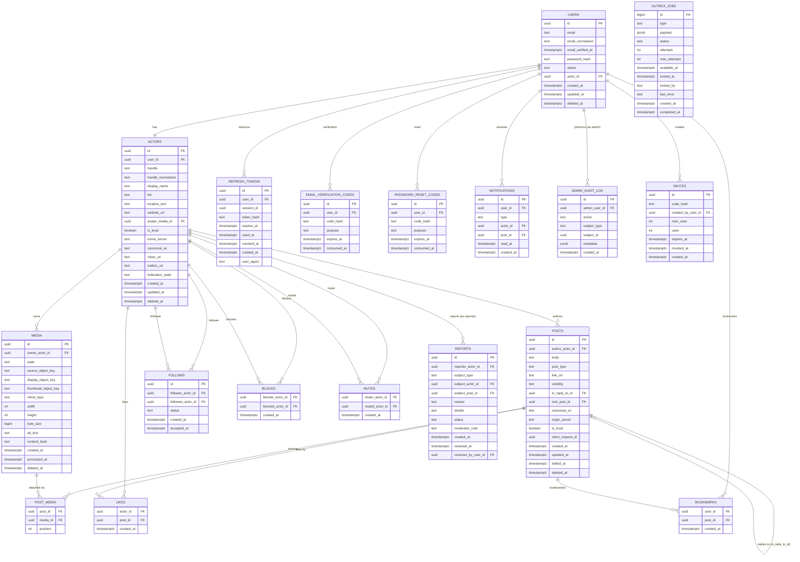

# Data model

PostgreSQL schema for Patches. Source of truth: `INITIAL_VISION.md` §14–27, §36,
§61–66, §113, §12–13, and the invite/credential/reaction tables implied throughout
§34–39 and §53.

## Conventions

- Naming: `snake_case` for tables, columns, indexes, constraints (§17). TypeScript
  code uses `camelCase`; do not let ORM defaults introduce inconsistent naming.
- Primary keys: `uuid` for every externally meaningful entity (users, actors, posts,
  media, reports, notifications, etc.). Internal queue/outbox records may use
  `bigint` (§18). Sequential database IDs are never exposed as public social
  identifiers.
- Timestamps: `timestamptz` throughout (`created_at`, `updated_at`, and friends).
- ORM: TypeORM, Data Mapper style. `synchronize: false`, `migrationsRun: false` in
  every environment; schema changes ship as reviewed migrations (§16.1–16.2).
- Soft deletion is used for posts, actors, media (tombstoning) — not hard deletes —
  to preserve thread integrity, moderation audit trail, and future federation
  `Delete` semantics (§25).

## Entity-relationship diagram



---

## `users`

A local authenticated account (§20). Distinct from `actors` — federation will
introduce remote actors with no local `User` (§19).

| Column              | Type          | Nullable | Notes                                                        |
| ------------------- | ------------- | -------- | ------------------------------------------------------------ |
| `id`                | `uuid`        | no       | PK                                                           |
| `email`             | `text`        | no       | as entered                                                   |
| `email_normalized`  | `text`        | no       | lowercased/normalized for uniqueness                         |
| `email_verified_at` | `timestamptz` | yes      | null until verified                                          |
| `password_hash`     | `text`        | no       | Argon2id (§34); never plaintext, never reversible encryption |
| `status`            | `text` (enum) | no       | `ACTIVE` \| `SUSPENDED` \| `DELETED`                         |
| `actor_id`          | `uuid`        | no       | FK → `actors.id`, unique                                     |
| `created_at`        | `timestamptz` | no       |                                                              |
| `updated_at`        | `timestamptz` | no       |                                                              |
| `deleted_at`        | `timestamptz` | yes      | soft delete                                                  |

**Constraints**: `UNIQUE (email_normalized)`. `actor_id` unique (1:1 with `actors`).

**Indexes**: unique index on `email_normalized`; index on `actor_id`.

---

## `actors`

A social identity — local or (later) remote (§21).

| Column              | Type          | Nullable | Notes                                                                         |
| ------------------- | ------------- | -------- | ----------------------------------------------------------------------------- |
| `id`                | `uuid`        | no       | PK                                                                            |
| `user_id`           | `uuid`        | yes      | FK → `users.id`, unique; null for remote actors                               |
| `handle`            | `text`        | no       | display-case-preserving                                                       |
| `handle_normalized` | `text`        | no       | lowercase canonical form                                                      |
| `display_name`      | `text`        | yes      |                                                                               |
| `bio`               | `text`        | yes      | max 500 chars (§58)                                                           |
| `location_text`     | `text`        | yes      | max 100 chars                                                                 |
| `website_url`       | `text`        | yes      | max 2,048 chars; scheme-validated (§104)                                      |
| `avatar_media_id`   | `uuid`        | yes      | FK → `media.id`                                                               |
| `is_local`          | `boolean`     | no       |                                                                               |
| `home_server`       | `text`        | yes      | remote actors only                                                            |
| `canonical_uri`     | `text`        | yes      | unique; stable production domain required before public federation (§21, §91) |
| `inbox_uri`         | `text`        | yes      | federation (F1+)                                                              |
| `outbox_uri`        | `text`        | yes      | federation (F1+)                                                              |
| `federation_state`  | `text`        | yes      | federation bookkeeping                                                        |
| `created_at`        | `timestamptz` | no       |                                                                               |
| `updated_at`        | `timestamptz` | no       |                                                                               |
| `deleted_at`        | `timestamptz` | yes      | tombstone                                                                     |

**Constraints**: `UNIQUE (handle_normalized)`. `UNIQUE (canonical_uri)` (nullable-safe
unique). `UNIQUE (user_id)`.

**Indexes**: `actors(handle_normalized)` UNIQUE (§60).

**Handle rules** (§22): lowercase canonical form, ASCII, letters/digits/underscore,
3–30 characters. No Unicode confusables in v0. Local handles render as `@alice`;
future federated handles render as `@alice@example.social`.

---

## `posts`

Root posts and replies share one table — there is no separate comment entity (§23).

| Column              | Type          | Nullable | Notes                                                                             |
| ------------------- | ------------- | -------- | --------------------------------------------------------------------------------- |
| `id`                | `uuid`        | no       | PK                                                                                |
| `author_actor_id`   | `uuid`        | no       | FK → `actors.id`                                                                  |
| `body`              | `text`        | yes      | max 5,000 Unicode chars (§58); nullable because a link/image-only post is allowed |
| `post_type`         | `text` (enum) | no       | `NOTE` \| `LINK`                                                                  |
| `link_url`          | `text`        | yes      | present when `post_type = LINK`                                                   |
| `visibility`        | `text` (enum) | no       | `PUBLIC` \| `UNLISTED` \| `FOLLOWERS`                                             |
| `in_reply_to_id`    | `uuid`        | yes      | FK → `posts.id`; null for root posts                                              |
| `root_post_id`      | `uuid`        | no       | FK → `posts.id`; self for root posts (§24)                                        |
| `canonical_uri`     | `text`        | yes      | unique; federation                                                                |
| `origin_server`     | `text`        | yes      | federation                                                                        |
| `is_local`          | `boolean`     | no       |                                                                                   |
| `client_request_id` | `uuid`        | yes      | idempotency key (§45)                                                             |
| `created_at`        | `timestamptz` | no       |                                                                                   |
| `updated_at`        | `timestamptz` | no       |                                                                                   |
| `edited_at`         | `timestamptz` | yes      | set on edit; original `created_at` preserved (§26)                                |
| `deleted_at`        | `timestamptz` | yes      | tombstone; body/media withheld from clients, renders `[deleted]` (§25)            |

**Constraints**:

- `CHECK`: post has at least one of `body`, an attached `post_media` row, or
  `link_url` (enforced at service layer; a DB-level check on media requires a
  cross-table trigger and MAY be added later — see §23).
- `UNIQUE (canonical_uri)`.
- `UNIQUE (author_actor_id, client_request_id)` where `client_request_id IS NOT NULL`
  — idempotent creation under retry (§45).

**Indexes** (§60):

- `posts(author_actor_id, created_at DESC, id DESC)`
- `posts(created_at DESC, id DESC)`
- `posts(root_post_id, created_at, id)`
- `posts(in_reply_to_id, created_at, id)`

**Thread representation** (§24): `root_post_id` avoids recursively walking upward to
find the thread root. A root post has `in_reply_to_id = NULL` and
`root_post_id = id`. Thread retrieval is bounded-depth and paginated — never load an
arbitrarily large thread in one request.

---

## `media`

| Column                 | Type          | Nullable | Notes                                                                |
| ---------------------- | ------------- | -------- | -------------------------------------------------------------------- |
| `id`                   | `uuid`        | no       | PK                                                                   |
| `owner_actor_id`       | `uuid`        | no       | FK → `actors.id`                                                     |
| `state`                | `text` (enum) | no       | `PENDING_UPLOAD` \| `PROCESSING` \| `READY` \| `FAILED` \| `DELETED` |
| `source_object_key`    | `text`        | yes      | R2 key for the original upload                                       |
| `display_object_key`   | `text`        | yes      | R2 key for the processed display derivative                          |
| `thumbnail_object_key` | `text`        | yes      | R2 key for the thumbnail derivative                                  |
| `mime_type`            | `text`        | yes      | server-verified, never trusted from client                           |
| `width`                | `int`         | yes      | decoded, not client-supplied                                         |
| `height`               | `int`         | yes      | decoded, not client-supplied                                         |
| `byte_size`            | `bigint`      | yes      |                                                                      |
| `alt_text`             | `text`        | yes      | max 1,000 chars (§58)                                                |
| `content_hash`         | `text`        | yes      | dedup/integrity                                                      |
| `created_at`           | `timestamptz` | no       |                                                                      |
| `processed_at`         | `timestamptz` | yes      |                                                                      |
| `deleted_at`           | `timestamptz` | yes      |                                                                      |

**Indexes**: `media(owner_actor_id, created_at)` (§60).

See `docs/architecture/media.md` for the full state machine and processing pipeline.

---

## `post_media`

Join table between posts and media (§27).

| Column     | Type   | Nullable | Notes                                         |
| ---------- | ------ | -------- | --------------------------------------------- |
| `post_id`  | `uuid` | no       | FK → `posts.id`                               |
| `media_id` | `uuid` | no       | FK → `media.id`                               |
| `position` | `int`  | no       | 0-based ordering, max 4 images per post (§28) |

**Constraints**: `UNIQUE (post_id, media_id)`. `UNIQUE (post_id, position)`.

---

## `follows`

| Column              | Type          | Nullable | Notes                                                                                           |
| ------------------- | ------------- | -------- | ----------------------------------------------------------------------------------------------- |
| `id`                | `uuid`        | no       | PK                                                                                              |
| `follower_actor_id` | `uuid`        | no       | FK → `actors.id`                                                                                |
| `followee_actor_id` | `uuid`        | no       | FK → `actors.id`                                                                                |
| `status`            | `text` (enum) | no       | `NONE` \| `PENDING` \| `FOLLOWING` (§50) — v0 local accounts transition straight to `FOLLOWING` |
| `created_at`        | `timestamptz` | no       |                                                                                                 |
| `accepted_at`       | `timestamptz` | yes      | set when status becomes `FOLLOWING`                                                             |

**Constraints**: `UNIQUE (follower_actor_id, followee_actor_id)`.

**Indexes** (§60): `follows(follower_actor_id, followee_actor_id)` UNIQUE;
`follows(follower_actor_id, created_at)`.

---

## `blocks`

| Column             | Type          | Nullable | Notes            |
| ------------------ | ------------- | -------- | ---------------- |
| `blocker_actor_id` | `uuid`        | no       | FK → `actors.id` |
| `blocked_actor_id` | `uuid`        | no       | FK → `actors.id` |
| `created_at`       | `timestamptz` | no       |                  |

**Constraints**: `UNIQUE (blocker_actor_id, blocked_actor_id)` (§60), composite PK.

**Block semantics** (§62): if A blocks B — B cannot follow A (existing follow is
removed/ignored); A does not see B in normal feeds; B cannot see A through
authenticated normal API surfaces; B cannot interact with A's posts; notifications
respect the block. Public-data limitations under federation are documented
separately once public web endpoints exist.

---

## `mutes`

| Column           | Type          | Nullable | Notes            |
| ---------------- | ------------- | -------- | ---------------- |
| `muter_actor_id` | `uuid`        | no       | FK → `actors.id` |
| `muted_actor_id` | `uuid`        | no       | FK → `actors.id` |
| `created_at`     | `timestamptz` | no       |                  |

**Constraints**: `UNIQUE (muter_actor_id, muted_actor_id)` (§60), composite PK.

**Mute semantics** (§63): does not notify the muted user; does not remove the follow
relationship automatically; hides the muted actor's posts from the muter's home feed;
suppresses notifications from the muted actor per product policy.

---

## `likes`

| Column       | Type          | Nullable | Notes            |
| ------------ | ------------- | -------- | ---------------- |
| `actor_id`   | `uuid`        | no       | FK → `actors.id` |
| `post_id`    | `uuid`        | no       | FK → `posts.id`  |
| `created_at` | `timestamptz` | no       |                  |

**Constraints**: `UNIQUE (actor_id, post_id)` (§60), composite PK.

---

## `bookmarks`

Private per-user saved posts (§53).

| Column       | Type          | Nullable | Notes           |
| ------------ | ------------- | -------- | --------------- |
| `user_id`    | `uuid`        | no       | FK → `users.id` |
| `post_id`    | `uuid`        | no       | FK → `posts.id` |
| `created_at` | `timestamptz` | no       |                 |

**Constraints**: `UNIQUE (user_id, post_id)` (§60), composite PK. Bookmarks are keyed
by `user_id`, not `actor_id` — they are a private account feature, not a public
social-graph action.

---

## `reports`

| Column                | Type          | Nullable | Notes                                              |
| --------------------- | ------------- | -------- | -------------------------------------------------- |
| `id`                  | `uuid`        | no       | PK                                                 |
| `reporter_actor_id`   | `uuid`        | no       | FK → `actors.id`                                   |
| `subject_type`        | `text` (enum) | no       | `ACTOR` \| `POST`                                  |
| `subject_actor_id`    | `uuid`        | yes      | FK → `actors.id`; set when `subject_type = ACTOR`  |
| `subject_post_id`     | `uuid`        | yes      | FK → `posts.id`; set when `subject_type = POST`    |
| `reason`              | `text`        | no       |                                                    |
| `details`             | `text`        | yes      |                                                    |
| `status`              | `text` (enum) | no       | `OPEN` \| `REVIEWING` \| `RESOLVED` \| `DISMISSED` |
| `moderator_note`      | `text`        | yes      | never exposed via user-facing API (§55)            |
| `created_at`          | `timestamptz` | no       |                                                    |
| `resolved_at`         | `timestamptz` | yes      |                                                    |
| `resolved_by_user_id` | `uuid`        | yes      | FK → `users.id`                                    |

Reported content is never auto-deleted merely because it was reported (§64).

---

## `refresh_tokens`

| Column       | Type          | Nullable | Notes                                                                  |
| ------------ | ------------- | -------- | ---------------------------------------------------------------------- |
| `id`         | `uuid`        | no       | PK                                                                     |
| `user_id`    | `uuid`        | no       | FK → `users.id`                                                        |
| `session_id` | `uuid`        | no       | groups a token family for rotation/reuse detection                     |
| `token_hash` | `text`        | no       | opaque, high-entropy token stored hashed — never plaintext (§36, §153) |
| `expires_at` | `timestamptz` | no       |                                                                        |
| `used_at`    | `timestamptz` | yes      | set when rotated away                                                  |
| `revoked_at` | `timestamptz` | yes      | set on logout / reuse-detected family revocation                       |
| `created_at` | `timestamptz` | no       |                                                                        |
| `user_agent` | `text`        | yes      |                                                                        |

**Behavior**: refresh tokens rotate on every refresh. If an already-rotated token is
presented again (reuse), the entire session/token family is revoked (§36).

---

## `email_verification_codes` / `password_reset_codes`

Two tables with the same shape, one per purpose (§38–39).

| Column        | Type          | Nullable | Notes                                                                                                |
| ------------- | ------------- | -------- | ---------------------------------------------------------------------------------------------------- |
| `id`          | `uuid`        | no       | PK                                                                                                   |
| `user_id`     | `uuid`        | no       | FK → `users.id`                                                                                      |
| `code_hash`   | `text`        | no       | hashed, never plaintext, never logged                                                                |
| `purpose`     | `text`        | no       | e.g. `EMAIL_VERIFICATION` / `PASSWORD_RESET` (redundant with table split; kept for defense-in-depth) |
| `expires_at`  | `timestamptz` | no       | short-lived                                                                                          |
| `consumed_at` | `timestamptz` | yes      | single-use                                                                                           |

---

## `notifications`

| Column       | Type          | Nullable | Notes                                                                  |
| ------------ | ------------- | -------- | ---------------------------------------------------------------------- |
| `id`         | `uuid`        | no       | PK                                                                     |
| `user_id`    | `uuid`        | no       | FK → `users.id` — recipient                                            |
| `type`       | `text` (enum) | no       | `FOLLOW` \| `LIKE` \| `REPLY` \| `MENTION` \| `MODERATION` (§113, §56) |
| `actor_id`   | `uuid`        | yes      | FK → `actors.id` — actor that triggered it                             |
| `post_id`    | `uuid`        | yes      | FK → `posts.id` — related post, if any                                 |
| `read_at`    | `timestamptz` | yes      |                                                                        |
| `created_at` | `timestamptz` | no       |                                                                        |

**Indexes** (§60): `notifications(user_id, created_at DESC, id DESC)`.

Notifications are deduplicated where appropriate (e.g., a worker retry must not
produce 74 identical `LIKE` notifications) (§113).

---

## `admin_audit_log`

| Column          | Type          | Nullable | Notes                                                               |
| --------------- | ------------- | -------- | ------------------------------------------------------------------- |
| `id`            | `uuid`        | no       | PK                                                                  |
| `admin_user_id` | `uuid`        | no       | FK → `users.id`                                                     |
| `action`        | `text`        | no       | e.g. `USER_SUSPEND`, `POST_REMOVE`, `INVITE_CREATE`                 |
| `subject_type`  | `text`        | no       | e.g. `USER`, `POST`, `REPORT`, `INVITE`                             |
| `subject_id`    | `uuid`        | no       |                                                                     |
| `metadata`      | `jsonb`       | yes      | never contains passwords, tokens, or reset/verification codes (§66) |
| `created_at`    | `timestamptz` | no       |                                                                     |

Every `patches-admin` mutating command writes an audit record (§65–66).

---

## `invites`

Referenced by §38 (invite-only registration) and §65 (`invite create` / `invite
list` admin commands); shape inferred from those requirements.

| Column               | Type          | Nullable | Notes                                             |
| -------------------- | ------------- | -------- | ------------------------------------------------- |
| `id`                 | `uuid`        | no       | PK                                                |
| `code_hash`          | `text`        | no       | invite code stored hashed, compared on redemption |
| `created_by_user_id` | `uuid`        | no       | FK → `users.id`                                   |
| `max_uses`           | `int`         | no       | default `1`, adjustable                           |
| `uses`               | `int`         | no       | default `0`                                       |
| `expires_at`         | `timestamptz` | yes      |                                                   |
| `revoked_at`         | `timestamptz` | yes      |                                                   |
| `created_at`         | `timestamptz` | no       |                                                   |

**Constraints**: `CHECK (uses <= max_uses)`.

---

## `outbox_jobs`

Durable job/outbox table backing background work and the transactional outbox
pattern (§12–13). Application mutations that require durable async follow-up (e.g.
sending a verification email) write the mutation and the outbox row in the **same
transaction**.

| Column         | Type          | Nullable | Notes                                                          |
| -------------- | ------------- | -------- | -------------------------------------------------------------- |
| `id`           | `bigint`      | no       | PK, identity/sequence                                          |
| `type`         | `text`        | no       | job type, see `jobs.md`                                        |
| `payload`      | `jsonb`       | no       | job-specific data                                              |
| `status`       | `text` (enum) | no       | `PENDING` \| `PROCESSING` \| `COMPLETED` \| `FAILED` \| `DEAD` |
| `attempts`     | `int`         | no       | default `0`                                                    |
| `max_attempts` | `int`         | no       |                                                                |
| `available_at` | `timestamptz` | no       | when the job becomes claimable (used for backoff)              |
| `locked_at`    | `timestamptz` | yes      |                                                                |
| `locked_by`    | `text`        | yes      | worker instance identifier                                     |
| `last_error`   | `text`        | yes      |                                                                |
| `created_at`   | `timestamptz` | no       |                                                                |
| `completed_at` | `timestamptz` | yes      |                                                                |

**Indexes** (§60): `outbox_events(status, available_at, id)`.

See `docs/architecture/jobs.md` for the claim query, backoff formula, and dead-letter
handling.

---

## Required index summary (§60)

```text
actors(handle_normalized) UNIQUE

posts(author_actor_id, created_at DESC, id DESC)
posts(created_at DESC, id DESC)
posts(root_post_id, created_at, id)
posts(in_reply_to_id, created_at, id)

follows(follower_actor_id, followee_actor_id) UNIQUE
follows(follower_actor_id, created_at)

blocks(blocker_actor_id, blocked_actor_id) UNIQUE
mutes(muter_actor_id, muted_actor_id) UNIQUE

likes(actor_id, post_id) UNIQUE

bookmarks(user_id, post_id) UNIQUE

notifications(user_id, created_at DESC, id DESC)

media(owner_actor_id, created_at)

outbox_events(status, available_at, id)
```

Validate with `EXPLAIN ANALYZE` once representative fixture data exists (§60, §126).
Some PostgreSQL-specific index definitions are written directly in migrations rather
than relying on TypeORM decorators (§16.2).

## Idempotency key (§45)

Creation RPCs that could be retried (e.g. `CreatePost`) carry a client-generated
`client_request_id: UUID`. The backend enforces a uniqueness constraint of the shape
`(author_actor_id, client_request_id)` so a retried write cannot duplicate the post.
Reads may retry transient failures freely; writes must not, unless idempotent by
construction.

## Soft-delete / tombstone semantics (§25)

Posts, actors, and media use `deleted_at` rather than row destruction. A deleted
post's body/media are withheld from normal clients and rendered as `[deleted]`; the
row itself persists for thread integrity, moderation audit, and future ActivityPub
`Delete`/tombstone federation. Actual data retention policy is documented separately
in `docs/operations/`.

## Thread representation (§24)

Replies are ordinary `posts` rows — there is no separate comment entity. Each post
stores `in_reply_to_id` (immediate parent, nullable) and `root_post_id` (thread root,
self-referencing for root posts) so thread retrieval never requires a recursive
upward walk. Thread reads are bounded-depth and paginated.
