# Data model

PostgreSQL schema for a Patches **node**. Source of truth: `INITIAL_VISION.md` §14–27, §36,
§61–66, §113, §12–13, the invite/credential/reaction tables implied throughout §34–39 and
§53, and **Amendment A §163–§173** (credentials, portability seam, pages, nameplates).

> **Amendment A changed this document.** `users.password_hash` is gone (superseded by
> `credentials`, §165), email is now nullable recovery-only, and `actors` gains portability
> and nameplate columns. See ADR
> [0011](../decisions/0011-credentials-separate-from-identity.md) and ADR
> [0012](../decisions/0012-patches-pages-portable-declarative.md).

> **Status markers.** Each table section below is marked `Status: implemented` (there is a
> reviewed TypeORM migration for it — currently
> `packages/database/src/migrations/1787036506325-Phase1Schema.ts`) or `Status: planned`
> (described here ahead of the migration that creates it). As of this migration, the
> **implemented** tables are: `app_meta`, `users`, `actors`, `credentials`,
> `ssh_login_challenges`, `auth_codes`, `refresh_tokens`, `invites`, `outbox_jobs`, `media`,
> `posts`, `post_media` — see `packages/database/src/entities/index.ts`'s `ALL_ENTITIES`.
> Everything else in this document (`follows`, `blocks`, `mutes`, `likes`, `bookmarks`,
> `reports`, `notifications`, `admin_audit_log`, and the `pages`/`page_revisions`/
> `page_assets`/`guestbook_entries` group) is **planned** — Phase 3 for the social-graph
> tables, Phase 4.5 for Pages.

## Conventions

- Naming: `snake_case` for tables, columns, indexes, constraints (§17). TypeScript
  code uses `camelCase`; do not let ORM defaults introduce inconsistent naming.
- Primary keys: `uuid` for every externally meaningful entity (users, actors, posts,
  media, reports, notifications, etc.). Internal queue/outbox records may use
  `bigint` (§18). Sequential database IDs are never exposed as public social
  identifiers.
- Timestamps: `timestamptz` throughout (`created_at`, `updated_at`, and friends).
- ORM: TypeORM, Data Mapper style. `synchronize: false`, `migrationsRun: false` in
  every environment; schema changes ship as reviewed migrations (§16.1–16.2).
- Soft deletion is used for posts, actors, media (tombstoning) — not hard deletes —
  to preserve thread integrity, moderation audit trail, and future federation
  `Delete` semantics (§25).

## Entity-relationship diagram

```mermaid
erDiagram
    USERS ||--o{ CREDENTIALS : "authenticates with"
    USERS ||--|| ACTORS : "has"
    ACTORS ||--o{ POSTS : "authors"
    ACTORS ||--o{ MEDIA : "owns"
    POSTS ||--o{ POST_MEDIA : "attaches"
    MEDIA ||--o{ POST_MEDIA : "attached via"
    POSTS ||--o{ POSTS : "replies to (in_reply_to_id)"
    ACTORS ||--o{ FOLLOWS : "follower"
    ACTORS ||--o{ FOLLOWS : "followee"
    ACTORS ||--o{ BLOCKS : "blocker"
    ACTORS ||--o{ BLOCKS : "blocked"
    ACTORS ||--o{ MUTES : "muter"
    ACTORS ||--o{ MUTES : "muted"
    ACTORS ||--o{ LIKES : "likes"
    POSTS ||--o{ LIKES : "liked by"
    USERS ||--o{ BOOKMARKS : "bookmarks"
    POSTS ||--o{ BOOKMARKS : "bookmarked"
    ACTORS ||--o{ REPORTS : "reports (as reporter)"
    USERS ||--o{ REFRESH_TOKENS : "sessions"
    USERS ||--o{ AUTH_CODES : "verification/reset"
    USERS ||--o{ NOTIFICATIONS : "receives"
    USERS ||--o{ ADMIN_AUDIT_LOG : "performs (as admin)"
    USERS ||--o{ INVITES : "creates"
    ACTORS ||--|| PAGES : "publishes"
    PAGES ||--o{ PAGE_REVISIONS : "versions"
    PAGES ||--o{ PAGE_ASSETS : "attaches"
    PAGES ||--o{ GUESTBOOK_ENTRIES : "collects"

    USERS {
        uuid id PK
        uuid actor_id FK
        text recovery_email
        text recovery_email_normalized
        timestamptz email_verified_at
        text status
        timestamptz created_at
        timestamptz updated_at
        timestamptz deleted_at
    }
    CREDENTIALS {
        uuid id PK
        uuid user_id FK
        text type
        text identifier
        text secret_hash
        text public_material
        jsonb metadata
        text label
        timestamptz created_at
        timestamptz last_used_at
        timestamptz revoked_at
    }
    ACTORS {
        uuid id PK
        uuid user_id FK
        text handle
        text handle_normalized
        text display_name
        text bio
        text location_text
        text website_url
        uuid avatar_media_id FK
        boolean is_local
        text home_server
        text canonical_uri
        text inbox_uri
        text outbox_uri
        text federation_state
        text moved_to_uri
        jsonb also_known_as
        jsonb nameplate
        timestamptz created_at
        timestamptz updated_at
        timestamptz deleted_at
    }
    PAGES {
        uuid id PK
        uuid actor_id FK
        uuid current_revision_id FK
        int schema_version
        timestamptz published_at
        timestamptz created_at
        timestamptz updated_at
    }
    PAGE_REVISIONS {
        uuid id PK
        uuid page_id FK
        int revision_number
        jsonb document
        int schema_version
        int byte_size
        uuid created_by_user_id FK
        timestamptz created_at
    }
    PAGE_ASSETS {
        uuid id PK
        uuid page_id FK
        uuid media_id FK
        bigint byte_size
        timestamptz created_at
    }
    GUESTBOOK_ENTRIES {
        uuid id PK
        uuid page_id FK
        uuid author_actor_id FK
        text body
        text status
        timestamptz created_at
        timestamptz deleted_at
    }
    POSTS {
        uuid id PK
        uuid author_actor_id FK
        text body
        text post_type
        text link_url
        text visibility
        uuid in_reply_to_id FK
        uuid root_post_id FK
        text canonical_uri
        text origin_server
        boolean is_local
        uuid client_request_id
        timestamptz created_at
        timestamptz updated_at
        timestamptz edited_at
        timestamptz deleted_at
    }
    MEDIA {
        uuid id PK
        uuid owner_actor_id FK
        text state
        text source_object_key
        text display_object_key
        text thumbnail_object_key
        text mime_type
        int width
        int height
        bigint byte_size
        text alt_text
        text content_hash
        timestamptz created_at
        timestamptz processed_at
        timestamptz deleted_at
    }
    POST_MEDIA {
        uuid post_id FK
        uuid media_id FK
        int position
    }
    FOLLOWS {
        uuid id PK
        uuid follower_actor_id FK
        uuid followee_actor_id FK
        text status
        timestamptz created_at
        timestamptz accepted_at
    }
    BLOCKS {
        uuid blocker_actor_id FK
        uuid blocked_actor_id FK
        timestamptz created_at
    }
    MUTES {
        uuid muter_actor_id FK
        uuid muted_actor_id FK
        timestamptz created_at
    }
    LIKES {
        uuid actor_id FK
        uuid post_id FK
        timestamptz created_at
    }
    BOOKMARKS {
        uuid user_id FK
        uuid post_id FK
        timestamptz created_at
    }
    REPORTS {
        uuid id PK
        uuid reporter_actor_id FK
        text subject_type
        uuid subject_actor_id FK
        uuid subject_post_id FK
        text reason
        text details
        text status
        text moderator_note
        timestamptz created_at
        timestamptz resolved_at
        uuid resolved_by_user_id FK
    }
    REFRESH_TOKENS {
        uuid id PK
        uuid user_id FK
        uuid session_id
        text token_hash
        timestamptz expires_at
        timestamptz used_at
        timestamptz revoked_at
        timestamptz created_at
        text user_agent
    }
    AUTH_CODES {
        uuid id PK
        uuid user_id FK
        text purpose
        text code_hash
        timestamptz expires_at
        timestamptz consumed_at
        int attempts
        timestamptz created_at
    }
    SSH_LOGIN_CHALLENGES {
        uuid id PK
        bytea nonce
        text claimed_handle
        timestamptz expires_at
        timestamptz consumed_at
        timestamptz created_at
    }
    NOTIFICATIONS {
        uuid id PK
        uuid user_id FK
        text type
        uuid actor_id FK
        uuid post_id FK
        timestamptz read_at
        timestamptz created_at
    }
    ADMIN_AUDIT_LOG {
        uuid id PK
        uuid admin_user_id FK
        text action
        text subject_type
        uuid subject_id
        jsonb metadata
        timestamptz created_at
    }
    INVITES {
        uuid id PK
        text code_hash
        text note
        uuid created_by_user_id FK
        int max_uses
        int uses
        timestamptz expires_at
        timestamptz revoked_at
        timestamptz created_at
    }
    OUTBOX_JOBS {
        bigint id PK
        text idempotency_key
        text type
        jsonb payload
        text status
        int attempts
        int max_attempts
        timestamptz available_at
        timestamptz locked_at
        text locked_by
        text last_error
        timestamptz created_at
        timestamptz completed_at
    }
    APP_META {
        text key PK
        jsonb value
        timestamptz updated_at
    }
```



`app_meta` has no foreign keys — it is schema-level key/value bookkeeping (e.g. a generated
`instance_id`), not part of the social graph, so it is omitted from the relationship lines
above.

---

## `users`

**Status: implemented**

A local authenticated account (§20, as amended by §165). Distinct from `actors` — federation
introduces remote actors with no local `User` (§19). **Credentials live in `credentials`, not
here**: `password_hash` was removed by Amendment A, and email is now optional recovery data
rather than the account identifier.

| Column                      | Type          | Nullable | Notes                                  |
| --------------------------- | ------------- | -------- | -------------------------------------- |
| `id`                        | `uuid`        | no       | PK                                     |
| `actor_id`                  | `uuid`        | no       | FK → `actors.id`, unique               |
| `recovery_email`            | `text`        | yes      | as entered; recovery/verification only |
| `recovery_email_normalized` | `text`        | yes      | lowercased/normalized for uniqueness   |
| `email_verified_at`         | `timestamptz` | yes      | null until verified                    |
| `status`                    | `text` (enum) | no       | `ACTIVE` \| `SUSPENDED` \| `DELETED`   |
| `created_at`                | `timestamptz` | no       |                                        |
| `updated_at`                | `timestamptz` | no       |                                        |
| `deleted_at`                | `timestamptz` | yes      | soft delete                            |

**Constraints**: `UNIQUE (recovery_email_normalized) WHERE recovery_email_normalized IS NOT
NULL`. `actor_id` unique (1:1 with `actors`).

**Indexes**: partial unique index on `recovery_email_normalized`; index on `actor_id`.

**Email policy** (§165): required and verified when the user's only credential is
`PASSWORD` (otherwise password reset has no channel); optional when the user holds a
non-password credential; a node may require it by policy. See
[`auth.md`](./auth.md) §8.

---

## `credentials`

**Status: implemented**

A way to prove you are a user — **not** an identity (§165, ADR 0011). Adding, rotating, or
revoking one never changes the actor, the handle, or any social relationship.

| Column            | Type          | Nullable | Notes                                                                   |
| ----------------- | ------------- | -------- | ----------------------------------------------------------------------- |
| `id`              | `uuid`        | no       | PK                                                                      |
| `user_id`         | `uuid`        | no       | FK → `users.id`                                                         |
| `type`            | `text` (enum) | no       | `PASSWORD` \| `SSH_PUBLIC_KEY` \| `GITHUB` (`PASSKEY` reserved, not v0) |
| `identifier`      | `text`        | yes      | type-scoped lookup key; see below                                       |
| `secret_hash`     | `text`        | yes      | Argon2id hash, `PASSWORD` only (§34). **Never logged, never in a DTO.** |
| `public_material` | `text`        | yes      | OpenSSH public key blob, `SSH_PUBLIC_KEY` only. Public, safe to return. |
| `metadata`        | `jsonb`       | yes      | non-secret provider bookkeeping (key type, GitHub login for display)    |
| `label`           | `text`        | yes      | user-supplied ("work laptop")                                           |
| `created_at`      | `timestamptz` | no       |                                                                         |
| `last_used_at`    | `timestamptz` | yes      |                                                                         |
| `revoked_at`      | `timestamptz` | yes      | revocation is soft; rows are retained for audit                         |

`identifier` by type:

| Type             | `identifier`                                                                   |
| ---------------- | ------------------------------------------------------------------------------ |
| `SSH_PUBLIC_KEY` | key fingerprint, OpenSSH `SHA256:<base64>` form                                |
| `GITHUB`         | GitHub **numeric account id** — never the login name (mutable, reusable, §167) |
| `PASSWORD`       | `NULL` — login resolves the user by handle or verified recovery email first    |

**Constraints**:

```sql
UNIQUE (user_id)         WHERE type = 'PASSWORD' AND revoked_at IS NULL
UNIQUE (type, identifier) WHERE revoked_at IS NULL AND identifier IS NOT NULL
```

**Service-layer invariants** (not expressible as constraints): revoking the last active
credential MUST fail; adding a credential MUST require an authenticated session;
`ListCredentials` returns type, label, identifier, `created_at`, `last_used_at` and **never**
`secret_hash`.

---

## `ssh_login_challenges`

**Status: implemented**

Server-issued nonces for SSH challenge/response login (§166,
[`auth.md`](./auth.md) §4).

| Column           | Type          | Nullable | Notes                                           |
| ---------------- | ------------- | -------- | ----------------------------------------------- |
| `id`             | `uuid`        | no       | PK; the challenge id bound into the signed blob |
| `nonce`          | `bytea`       | no       | ≥ 32 bytes from a CSPRNG                        |
| `claimed_handle` | `text`        | yes      | set only when the client claims a handle        |
| `expires_at`     | `timestamptz` | no       | TTL ≤ 120 seconds                               |
| `consumed_at`    | `timestamptz` | yes      | single-use; consumed atomically                 |
| `created_at`     | `timestamptz` | no       |                                                 |

Expired rows are swept by a periodic job. Challenges are issued regardless of whether any
supplied fingerprint is enrolled — see the no-enumeration rule in §166.

---

## `actors`

**Status: implemented**

A social identity — local or (later) remote (§21).

| Column              | Type          | Nullable | Notes                                                                         |
| ------------------- | ------------- | -------- | ----------------------------------------------------------------------------- |
| `id`                | `uuid`        | no       | PK                                                                            |
| `user_id`           | `uuid`        | yes      | FK → `users.id`, unique; null for remote actors                               |
| `handle`            | `text`        | no       | display-case-preserving                                                       |
| `handle_normalized` | `text`        | no       | lowercase canonical form                                                      |
| `display_name`      | `text`        | yes      |                                                                               |
| `bio`               | `text`        | yes      | max 500 chars (§58)                                                           |
| `location_text`     | `text`        | yes      | max 100 chars                                                                 |
| `website_url`       | `text`        | yes      | max 2,048 chars; scheme-validated (§104)                                      |
| `avatar_media_id`   | `uuid`        | yes      | FK → `media.id`                                                               |
| `is_local`          | `boolean`     | no       |                                                                               |
| `home_server`       | `text`        | yes      | remote actors only                                                            |
| `canonical_uri`     | `text`        | yes      | unique; stable production domain required before public federation (§21, §91) |
| `inbox_uri`         | `text`        | yes      | federation (F1+)                                                              |
| `outbox_uri`        | `text`        | yes      | federation (F1+)                                                              |
| `federation_state`  | `text`        | yes      | federation bookkeeping                                                        |
| `moved_to_uri`      | `text`        | yes      | portability seam (§164); unused until v0.4                                    |
| `also_known_as`     | `jsonb`       | yes      | prior/alternate actor URIs this actor claims (§164); unused until v0.4        |
| `nameplate`         | `jsonb`       | yes      | bounded (≤ 2 KiB) inline identity presentation (§173)                         |
| `created_at`        | `timestamptz` | no       |                                                                               |
| `updated_at`        | `timestamptz` | no       |                                                                               |
| `deleted_at`        | `timestamptz` | yes      | tombstone                                                                     |

**Constraints**: `UNIQUE (handle_normalized)`. `UNIQUE (canonical_uri)` (nullable-safe
unique). `UNIQUE (user_id)`.

**Indexes**: `actors(handle_normalized)` UNIQUE (§60); `actors(canonical_uri)` UNIQUE.

**Handle rules** (§22): lowercase canonical form, ASCII, letters/digits/underscore,
3–30 characters. No Unicode confusables in v0. Local handles render as `@alice`;
federated handles render as `@alice@example.social`. A handle is unique **within a node**
only — there is no global handle namespace (§163).

**Portability** (§164): an actor with `moved_to_uri` set is read-only — no new posts, no new
follows accepted. A move is honored only when the destination actor claims the origin actor
in `also_known_as`; a one-sided claim is never trusted. Naming note: `movedTo`/`alsoKnownAs`
are Mastodon-originated, non-normative community properties, not standard ActivityStreams —
these columns are ours and are mapped only at the federation boundary.

**Nameplate** (§173): validated at write time against the capabilities the node grants that
user (§174). Badges within it are server-attested only — a user cannot set badge text.

---

## `posts`

**Status: implemented**

Root posts and replies share one table — there is no separate comment entity (§23).

| Column              | Type          | Nullable | Notes                                                                             |
| ------------------- | ------------- | -------- | --------------------------------------------------------------------------------- |
| `id`                | `uuid`        | no       | PK                                                                                |
| `author_actor_id`   | `uuid`        | no       | FK → `actors.id`                                                                  |
| `body`              | `text`        | yes      | max 5,000 Unicode chars (§58); nullable because a link/image-only post is allowed |
| `post_type`         | `text` (enum) | no       | `NOTE` \| `LINK`                                                                  |
| `link_url`          | `text`        | yes      | present when `post_type = LINK`                                                   |
| `visibility`        | `text` (enum) | no       | `PUBLIC` \| `UNLISTED` \| `FOLLOWERS`                                             |
| `in_reply_to_id`    | `uuid`        | yes      | FK → `posts.id`; null for root posts                                              |
| `root_post_id`      | `uuid`        | no       | FK → `posts.id`; self for root posts (§24)                                        |
| `canonical_uri`     | `text`        | yes      | unique; federation                                                                |
| `origin_server`     | `text`        | yes      | federation                                                                        |
| `is_local`          | `boolean`     | no       |                                                                                   |
| `client_request_id` | `uuid`        | yes      | idempotency key (§45)                                                             |
| `created_at`        | `timestamptz` | no       |                                                                                   |
| `updated_at`        | `timestamptz` | no       |                                                                                   |
| `edited_at`         | `timestamptz` | yes      | set on edit; original `created_at` preserved (§26)                                |
| `deleted_at`        | `timestamptz` | yes      | tombstone; body/media withheld from clients, renders `[deleted]` (§25)            |

**Constraints**:

- `CHECK`: post has at least one of `body`, an attached `post_media` row, or
  `link_url` (enforced at service layer; a DB-level check on media requires a
  cross-table trigger and MAY be added later — see §23).
- `UNIQUE (canonical_uri)`.
- `UNIQUE (author_actor_id, client_request_id)` where `client_request_id IS NOT NULL`
  — idempotent creation under retry (§45).

**Indexes** (§60):

- `posts(author_actor_id, created_at DESC, id DESC)`
- `posts(created_at DESC, id DESC)`
- `posts(root_post_id, created_at, id)`
- `posts(in_reply_to_id, created_at, id)`

**Thread representation** (§24): `root_post_id` avoids recursively walking upward to
find the thread root. A root post has `in_reply_to_id = NULL` and
`root_post_id = id`. Thread retrieval is bounded-depth and paginated — never load an
arbitrarily large thread in one request.

---

## `media`

**Status: implemented**

| Column                 | Type          | Nullable | Notes                                                                |
| ---------------------- | ------------- | -------- | -------------------------------------------------------------------- |
| `id`                   | `uuid`        | no       | PK                                                                   |
| `owner_actor_id`       | `uuid`        | no       | FK → `actors.id`                                                     |
| `state`                | `text` (enum) | no       | `PENDING_UPLOAD` \| `PROCESSING` \| `READY` \| `FAILED` \| `DELETED` |
| `source_object_key`    | `text`        | yes      | R2 key for the original upload                                       |
| `display_object_key`   | `text`        | yes      | R2 key for the processed display derivative                          |
| `thumbnail_object_key` | `text`        | yes      | R2 key for the thumbnail derivative                                  |
| `mime_type`            | `text`        | yes      | server-verified, never trusted from client                           |
| `width`                | `int`         | yes      | decoded, not client-supplied                                         |
| `height`               | `int`         | yes      | decoded, not client-supplied                                         |
| `byte_size`            | `bigint`      | yes      |                                                                      |
| `alt_text`             | `text`        | yes      | max 1,000 chars (§58)                                                |
| `content_hash`         | `text`        | yes      | dedup/integrity                                                      |
| `created_at`           | `timestamptz` | no       |                                                                      |
| `processed_at`         | `timestamptz` | yes      |                                                                      |
| `deleted_at`           | `timestamptz` | yes      |                                                                      |

**Indexes**: `media(owner_actor_id, created_at)` (§60).

See `docs/architecture/media.md` for the full state machine and processing pipeline.

---

## `post_media`

**Status: implemented**

Join table between posts and media (§27).

| Column     | Type   | Nullable | Notes                                         |
| ---------- | ------ | -------- | --------------------------------------------- |
| `post_id`  | `uuid` | no       | FK → `posts.id`                               |
| `media_id` | `uuid` | no       | FK → `media.id`                               |
| `position` | `int`  | no       | 0-based ordering, max 4 images per post (§28) |

**Constraints**: `UNIQUE (post_id, media_id)`. `UNIQUE (post_id, position)`.

---

## `follows`

**Status: planned**

| Column              | Type          | Nullable | Notes                                                                                           |
| ------------------- | ------------- | -------- | ----------------------------------------------------------------------------------------------- |
| `id`                | `uuid`        | no       | PK                                                                                              |
| `follower_actor_id` | `uuid`        | no       | FK → `actors.id`                                                                                |
| `followee_actor_id` | `uuid`        | no       | FK → `actors.id`                                                                                |
| `status`            | `text` (enum) | no       | `NONE` \| `PENDING` \| `FOLLOWING` (§50) — v0 local accounts transition straight to `FOLLOWING` |
| `created_at`        | `timestamptz` | no       |                                                                                                 |
| `accepted_at`       | `timestamptz` | yes      | set when status becomes `FOLLOWING`                                                             |

**Constraints**: `UNIQUE (follower_actor_id, followee_actor_id)`.

**Indexes** (§60): `follows(follower_actor_id, followee_actor_id)` UNIQUE;
`follows(follower_actor_id, created_at)`.

---

## `blocks`

**Status: planned**

| Column             | Type          | Nullable | Notes            |
| ------------------ | ------------- | -------- | ---------------- |
| `blocker_actor_id` | `uuid`        | no       | FK → `actors.id` |
| `blocked_actor_id` | `uuid`        | no       | FK → `actors.id` |
| `created_at`       | `timestamptz` | no       |                  |

**Constraints**: `UNIQUE (blocker_actor_id, blocked_actor_id)` (§60), composite PK.

**Block semantics** (§62): if A blocks B — B cannot follow A (existing follow is
removed/ignored); A does not see B in normal feeds; B cannot see A through
authenticated normal API surfaces; B cannot interact with A's posts; notifications
respect the block. Public-data limitations under federation are documented
separately once public web endpoints exist.

---

## `mutes`

**Status: planned**

| Column           | Type          | Nullable | Notes            |
| ---------------- | ------------- | -------- | ---------------- |
| `muter_actor_id` | `uuid`        | no       | FK → `actors.id` |
| `muted_actor_id` | `uuid`        | no       | FK → `actors.id` |
| `created_at`     | `timestamptz` | no       |                  |

**Constraints**: `UNIQUE (muter_actor_id, muted_actor_id)` (§60), composite PK.

**Mute semantics** (§63): does not notify the muted user; does not remove the follow
relationship automatically; hides the muted actor's posts from the muter's home feed;
suppresses notifications from the muted actor per product policy.

---

## `likes`

**Status: planned**

| Column       | Type          | Nullable | Notes            |
| ------------ | ------------- | -------- | ---------------- |
| `actor_id`   | `uuid`        | no       | FK → `actors.id` |
| `post_id`    | `uuid`        | no       | FK → `posts.id`  |
| `created_at` | `timestamptz` | no       |                  |

**Constraints**: `UNIQUE (actor_id, post_id)` (§60), composite PK.

---

## `bookmarks`

**Status: planned**

Private per-user saved posts (§53).

| Column       | Type          | Nullable | Notes           |
| ------------ | ------------- | -------- | --------------- |
| `user_id`    | `uuid`        | no       | FK → `users.id` |
| `post_id`    | `uuid`        | no       | FK → `posts.id` |
| `created_at` | `timestamptz` | no       |                 |

**Constraints**: `UNIQUE (user_id, post_id)` (§60), composite PK. Bookmarks are keyed
by `user_id`, not `actor_id` — they are a private account feature, not a public
social-graph action.

---

## `reports`

**Status: planned**

| Column                | Type          | Nullable | Notes                                              |
| --------------------- | ------------- | -------- | -------------------------------------------------- |
| `id`                  | `uuid`        | no       | PK                                                 |
| `reporter_actor_id`   | `uuid`        | no       | FK → `actors.id`                                   |
| `subject_type`        | `text` (enum) | no       | `ACTOR` \| `POST`                                  |
| `subject_actor_id`    | `uuid`        | yes      | FK → `actors.id`; set when `subject_type = ACTOR`  |
| `subject_post_id`     | `uuid`        | yes      | FK → `posts.id`; set when `subject_type = POST`    |
| `reason`              | `text`        | no       |                                                    |
| `details`             | `text`        | yes      |                                                    |
| `status`              | `text` (enum) | no       | `OPEN` \| `REVIEWING` \| `RESOLVED` \| `DISMISSED` |
| `moderator_note`      | `text`        | yes      | never exposed via user-facing API (§55)            |
| `created_at`          | `timestamptz` | no       |                                                    |
| `resolved_at`         | `timestamptz` | yes      |                                                    |
| `resolved_by_user_id` | `uuid`        | yes      | FK → `users.id`                                    |

Reported content is never auto-deleted merely because it was reported (§64).

---

## `refresh_tokens`

**Status: implemented**

| Column       | Type          | Nullable | Notes                                                                  |
| ------------ | ------------- | -------- | ---------------------------------------------------------------------- |
| `id`         | `uuid`        | no       | PK                                                                     |
| `user_id`    | `uuid`        | no       | FK → `users.id`                                                        |
| `session_id` | `uuid`        | no       | groups a token family for rotation/reuse detection                     |
| `token_hash` | `text`        | no       | opaque, high-entropy token stored hashed — never plaintext (§36, §153) |
| `expires_at` | `timestamptz` | no       |                                                                        |
| `used_at`    | `timestamptz` | yes      | set when rotated away                                                  |
| `revoked_at` | `timestamptz` | yes      | set on logout / reuse-detected family revocation                       |
| `created_at` | `timestamptz` | no       |                                                                        |
| `user_agent` | `text`        | yes      |                                                                        |

**Indexes**: `refresh_tokens(token_hash)` UNIQUE; `refresh_tokens(user_id, created_at)`;
`refresh_tokens(session_id)`.

**Behavior**: refresh tokens rotate on every refresh. If an already-rotated token is
presented again (reuse), the entire session/token family is revoked (§36).

---

## `auth_codes`

**Status: implemented**

A short-lived, single-use code emailed to a user. Email verification (§38) and password
reset (§39) share this one table, discriminated by `purpose` — the two have identical shape
and identical lifecycle rules, so splitting them into `email_verification_codes` and
`password_reset_codes` (an earlier version of this document) would only duplicate every
expiry, consumption, and throttling query. Applies only to users with a verified
`recovery_email` (§165) — an account without one has no reset channel by design and recovers
by holding a second credential.

| Column        | Type          | Nullable | Notes                                                                     |
| ------------- | ------------- | -------- | ------------------------------------------------------------------------- |
| `id`          | `uuid`        | no       | PK                                                                        |
| `user_id`     | `uuid`        | no       | FK → `users.id`, `ON DELETE CASCADE`                                      |
| `purpose`     | `text` (enum) | no       | `VERIFY_EMAIL` \| `RESET_PASSWORD`                                        |
| `code_hash`   | `text`        | no       | hashed, never plaintext, never logged                                     |
| `expires_at`  | `timestamptz` | no       | short-lived                                                               |
| `consumed_at` | `timestamptz` | yes      | single-use                                                                |
| `attempts`    | `int`         | no       | default `0`; failed-verification counter backs per-code throttling (§102) |
| `created_at`  | `timestamptz` | no       |                                                                           |

**Indexes**: `auth_codes(user_id, purpose, created_at)`; `auth_codes(code_hash)`.

**Constraints**: `CHECK (purpose IN ('VERIFY_EMAIL', 'RESET_PASSWORD'))`.

---

## `notifications`

**Status: planned**

| Column       | Type          | Nullable | Notes                                                                  |
| ------------ | ------------- | -------- | ---------------------------------------------------------------------- |
| `id`         | `uuid`        | no       | PK                                                                     |
| `user_id`    | `uuid`        | no       | FK → `users.id` — recipient                                            |
| `type`       | `text` (enum) | no       | `FOLLOW` \| `LIKE` \| `REPLY` \| `MENTION` \| `MODERATION` (§113, §56) |
| `actor_id`   | `uuid`        | yes      | FK → `actors.id` — actor that triggered it                             |
| `post_id`    | `uuid`        | yes      | FK → `posts.id` — related post, if any                                 |
| `read_at`    | `timestamptz` | yes      |                                                                        |
| `created_at` | `timestamptz` | no       |                                                                        |

**Indexes** (§60): `notifications(user_id, created_at DESC, id DESC)`.

Notifications are deduplicated where appropriate (e.g., a worker retry must not
produce 74 identical `LIKE` notifications) (§113).

---

## `admin_audit_log`

**Status: planned**

| Column          | Type          | Nullable | Notes                                                               |
| --------------- | ------------- | -------- | ------------------------------------------------------------------- |
| `id`            | `uuid`        | no       | PK                                                                  |
| `admin_user_id` | `uuid`        | no       | FK → `users.id`                                                     |
| `action`        | `text`        | no       | e.g. `USER_SUSPEND`, `POST_REMOVE`, `INVITE_CREATE`                 |
| `subject_type`  | `text`        | no       | e.g. `USER`, `POST`, `REPORT`, `INVITE`                             |
| `subject_id`    | `uuid`        | no       |                                                                     |
| `metadata`      | `jsonb`       | yes      | never contains passwords, tokens, or reset/verification codes (§66) |
| `created_at`    | `timestamptz` | no       |                                                                     |

Every `patches-admin` mutating command writes an audit record (§65–66).

---

## `invites`

**Status: implemented**

Referenced by §38 (invite-only registration) and §65 (`invite create` / `invite
list` admin commands); shape inferred from those requirements.

| Column               | Type          | Nullable | Notes                                             |
| -------------------- | ------------- | -------- | ------------------------------------------------- |
| `id`                 | `uuid`        | no       | PK                                                |
| `code_hash`          | `text`        | no       | invite code stored hashed, compared on redemption |
| `created_by_user_id` | `uuid`        | no       | FK → `users.id`                                   |
| `max_uses`           | `int`         | no       | default `1`, adjustable                           |
| `uses`               | `int`         | no       | default `0`                                       |
| `expires_at`         | `timestamptz` | yes      |                                                   |
| `revoked_at`         | `timestamptz` | yes      |                                                   |
| `created_at`         | `timestamptz` | no       |                                                   |

**Constraints**: `CHECK (uses >= 0 AND max_uses >= 1 AND uses <= max_uses)`.

**Indexes**: `invites(code_hash)` UNIQUE; `invites(created_by_user_id, created_at)`.

---

## `outbox_jobs`

**Status: implemented**

Durable job/outbox table backing background work and the transactional outbox
pattern (§12–13). Application mutations that require durable async follow-up (e.g.
sending a verification email) write the mutation and the outbox row in the **same
transaction**.

| Column            | Type          | Nullable | Notes                                                          |
| ----------------- | ------------- | -------- | -------------------------------------------------------------- |
| `id`              | `bigint`      | no       | PK, identity/sequence                                          |
| `type`            | `text`        | no       | job type, see `jobs.md`                                        |
| `payload`         | `jsonb`       | no       | job-specific data                                              |
| `status`          | `text` (enum) | no       | `PENDING` \| `PROCESSING` \| `COMPLETED` \| `FAILED` \| `DEAD` |
| `attempts`        | `int`         | no       | default `0`                                                    |
| `max_attempts`    | `int`         | no       | default `10`                                                   |
| `available_at`    | `timestamptz` | no       | when the job becomes claimable (used for backoff)              |
| `locked_at`       | `timestamptz` | yes      |                                                                |
| `locked_by`       | `text`        | yes      | worker instance identifier                                     |
| `last_error`      | `text`        | yes      |                                                                |
| `idempotency_key` | `text`        | yes      | optional producer-side dedup key; unique where present         |
| `created_at`      | `timestamptz` | no       |                                                                |
| `completed_at`    | `timestamptz` | yes      |                                                                |

**Constraints**: `CHECK (attempts >= 0 AND max_attempts >= 1)`. `UNIQUE (idempotency_key)`
(nullable-safe unique).

**Indexes** (§60): `outbox_jobs(status, available_at, id)`.

See `docs/architecture/jobs.md` for the claim query, backoff formula, and dead-letter
handling.

---

## `app_meta`

**Status: implemented**

Schema-level key/value metadata (e.g. a generated `instance_id`) — not part of the social
graph. Deliberately the only entity wired up in Phase 0, to prove the `DataSource` /
migration / `snake_case`-naming-strategy plumbing end to end before Phase 1 added the real
entities.

| Column       | Type          | Nullable | Notes                 |
| ------------ | ------------- | -------- | --------------------- |
| `key`        | `text`        | no       | PK                    |
| `value`      | `jsonb`       | no       |                       |
| `updated_at` | `timestamptz` | no       | stamped on every save |

---

## Page tables (§170–§172)

**Status: planned** (Phase 4.5)

Patches Pages are a portable declarative document stored server-side and rendered by clients.
The server never renders. Block vocabulary, limits, and security rules are in
[`pages.md`](./pages.md).

### `pages`

One row per actor — the actor's site, pointing at its current revision.

| Column                | Type          | Nullable | Notes                        |
| --------------------- | ------------- | -------- | ---------------------------- |
| `id`                  | `uuid`        | no       | PK                           |
| `actor_id`            | `uuid`        | no       | FK → `actors.id`, **unique** |
| `current_revision_id` | `uuid`        | yes      | FK → `page_revisions.id`     |
| `schema_version`      | `int`         | no       | document schema version      |
| `published_at`        | `timestamptz` | yes      | null while unpublished       |
| `created_at`          | `timestamptz` | no       |                              |
| `updated_at`          | `timestamptz` | no       |                              |

### `page_revisions`

Immutable snapshots — a bad edit is recoverable and moderation has an audit trail.

| Column               | Type          | Nullable | Notes                                            |
| -------------------- | ------------- | -------- | ------------------------------------------------ |
| `id`                 | `uuid`        | no       | PK                                               |
| `page_id`            | `uuid`        | no       | FK → `pages.id`                                  |
| `revision_number`    | `int`         | no       | monotonic per page                               |
| `document`           | `jsonb`       | no       | the `PatchesPage` document; ≤ 64 KiB serialized  |
| `schema_version`     | `int`         | no       | validated strictly against this version on write |
| `byte_size`          | `int`         | no       | enforced against the document limit              |
| `created_by_user_id` | `uuid`        | no       | FK → `users.id`                                  |
| `created_at`         | `timestamptz` | no       |                                                  |

**Constraints**: `UNIQUE (page_id, revision_number)`. Rows are never updated.

### `page_assets`

Media attached to a page, counted against `capabilities.maxSiteStorageBytes` (§174).

| Column       | Type          | Nullable | Notes                                         |
| ------------ | ------------- | -------- | --------------------------------------------- |
| `id`         | `uuid`        | no       | PK                                            |
| `page_id`    | `uuid`        | no       | FK → `pages.id`                               |
| `media_id`   | `uuid`        | no       | FK → `media.id` — always Patches media (§172) |
| `byte_size`  | `bigint`      | no       | denormalized for cheap storage accounting     |
| `created_at` | `timestamptz` | no       |                                               |

**Constraints**: `UNIQUE (page_id, media_id)`. Remote URLs are never referenced — arbitrary
remote media is an SSRF, tracking, and visitor-IP-leak vector (§172).

### `guestbook_entries`

Visitor entries. Treated as hostile input (§172).

| Column            | Type          | Nullable | Notes                                                     |
| ----------------- | ------------- | -------- | --------------------------------------------------------- |
| `id`              | `uuid`        | no       | PK                                                        |
| `page_id`         | `uuid`        | no       | FK → `pages.id`                                           |
| `author_actor_id` | `uuid`        | yes      | FK → `actors.id`; nullable for future remote signers      |
| `body`            | `text`        | no       | plain text, ≤ 500 characters, control characters stripped |
| `status`          | `text` (enum) | no       | `VISIBLE` \| `HIDDEN` \| `PENDING` \| `SPAM`              |
| `created_at`      | `timestamptz` | no       |                                                           |
| `deleted_at`      | `timestamptz` | yes      | removable by page owner and by moderators                 |

Blocked actors cannot sign (§62). Creation is rate-limited (§102) and entries are reportable
(§64).

---

## Required index summary (§60)

```text
actors(handle_normalized) UNIQUE
actors(canonical_uri) UNIQUE

users(recovery_email_normalized) UNIQUE
users(actor_id) UNIQUE

credentials(user_id) UNIQUE WHERE type = 'PASSWORD' AND revoked_at IS NULL
credentials(type, identifier) UNIQUE WHERE revoked_at IS NULL AND identifier IS NOT NULL
credentials(user_id, type)

ssh_login_challenges(expires_at)

auth_codes(user_id, purpose, created_at)
auth_codes(code_hash)

refresh_tokens(token_hash) UNIQUE
refresh_tokens(user_id, created_at)
refresh_tokens(session_id)

invites(code_hash) UNIQUE
invites(created_by_user_id, created_at)

pages(actor_id) UNIQUE
page_revisions(page_id, revision_number) UNIQUE
page_assets(page_id, media_id) UNIQUE
guestbook_entries(page_id, created_at DESC, id DESC)

posts(author_actor_id, created_at DESC, id DESC)
posts(created_at DESC, id DESC)
posts(root_post_id, created_at, id)
posts(in_reply_to_id, created_at, id)
posts(canonical_uri) UNIQUE
posts(author_actor_id, client_request_id) UNIQUE

post_media(post_id, position) UNIQUE

follows(follower_actor_id, followee_actor_id) UNIQUE
follows(follower_actor_id, created_at)

blocks(blocker_actor_id, blocked_actor_id) UNIQUE
mutes(muter_actor_id, muted_actor_id) UNIQUE

likes(actor_id, post_id) UNIQUE

bookmarks(user_id, post_id) UNIQUE

notifications(user_id, created_at DESC, id DESC)

media(owner_actor_id, created_at)

outbox_jobs(status, available_at, id)
outbox_jobs(idempotency_key) UNIQUE
```

Validate with `EXPLAIN ANALYZE` once representative fixture data exists (§60, §126).
Some PostgreSQL-specific index definitions are written directly in migrations rather
than relying on TypeORM decorators (§16.2).

## Idempotency key (§45)

Creation RPCs that could be retried (e.g. `CreatePost`) carry a client-generated
`client_request_id: UUID`. The backend enforces a uniqueness constraint of the shape
`(author_actor_id, client_request_id)` so a retried write cannot duplicate the post.
Reads may retry transient failures freely; writes must not, unless idempotent by
construction.

## Soft-delete / tombstone semantics (§25)

Posts, actors, and media use `deleted_at` rather than row destruction. A deleted
post's body/media are withheld from normal clients and rendered as `[deleted]`; the
row itself persists for thread integrity, moderation audit, and future ActivityPub
`Delete`/tombstone federation. Actual data retention policy is documented separately
in `docs/operations/`.

## Thread representation (§24)

Replies are ordinary `posts` rows — there is no separate comment entity. Each post
stores `in_reply_to_id` (immediate parent, nullable) and `root_post_id` (thread root,
self-referencing for root posts) so thread retrieval never requires a recursive
upward walk. Thread reads are bounded-depth and paginated.
