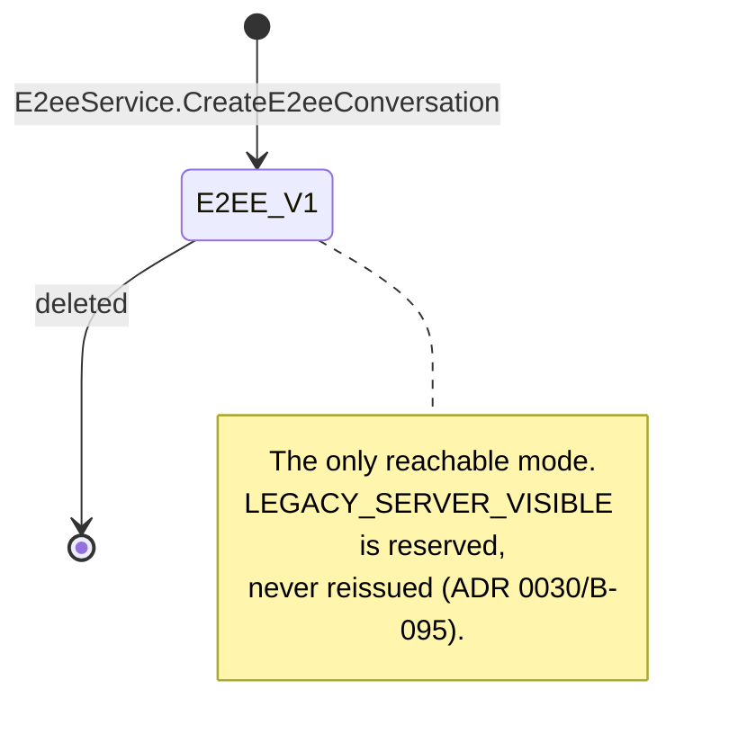
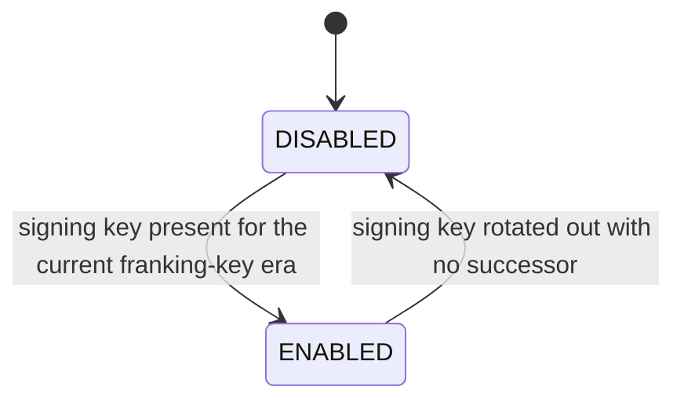

# End-to-end encrypted direct messages

**Status: always-on feature.** [ADR 0036's Amendment](../decisions/0036-shipping-e2ee-conditions-capability-states-and-copy.md)
(2026-08-26, owner override) supersedes the staged-rollout plan below: the reference node is
pre-alpha, invite-only, with no real conversations, so `packages/domain`'s
`E2EE_APPROVED_FRANKING_PROFILES` approves the shipped profile by default and `GetE2eeCapability`
reports `ENABLED` whenever the node has a signing key for its current franking-key era —
`DISABLED` otherwise. There is no separate "unreviewed dev mode" flag or banner anymore.

[ADR 0020](../decisions/0020-e2ee-direct-messages.md) is still binding for the protocol contract
this document records — the sections below describing the review-gated rollout ladder are
historical/superseded (see the ADR 0036 amendment) but the wire/domain contract, franking, and
standing disclosures they document remain accurate.

Where to look:

| Layer               | Path                                                 |
| ------------------- | ---------------------------------------------------- |
| Wire contract       | `packages/proto/proto/patches/v1/e2ee.proto`         |
| Domain contract     | `packages/domain/src/e2ee/`                          |
| Primitives, ratchet | `packages/crypto/` (see its `README.md`)             |
| Persistence         | `packages/database/src/entities/` (`e2ee*`, P13-002) |
| Decision of record  | `docs/decisions/0020-e2ee-direct-messages.md`        |
| Audit of the spike  | `docs/research/e2ee-dms.md`                          |

## 1. Conversation modes

| Mode      | Node body access                                     | Mutation / fallback |
| --------- | ---------------------------------------------------- | ------------------- |
| `E2EE_V1` | The node routes opaque ciphertext and metadata only. | Immutable.          |

`CONVERSATION_SECURITY_MODE_LEGACY_SERVER_VISIBLE` (the plaintext, server-readable mode ADR 0017
originally shipped) is **retired**: ADR 0030/B-095 removed its enum value (reserved, never
reissued) and deleted `DirectMessageService`'s plaintext send/read/delete RPCs and the
message-request flow. `E2EE_V1` is the only conversation security mode a client can reach today.

The mode is fixed at creation and there is no transition RPC in any schema. An E2EE send fails
when the capability or any active participant device is unavailable; it never falls back to
plaintext, and a client that cannot speak the protocol cannot join or render the conversation.

`packages/domain/src/e2ee/modes.ts` pins the immutable mode, the rollout states, the
8-member/8-device fanout bound, the 100 one-time-prekey target, the seven-day signed-prekey
rotation, the ten-message report-context limit, and the no-downgrade negotiation rule.



## 2. Identity: root, devices, roster

Three signed objects, each verified by the client rather than asserted by the node.

1. **Messaging identity root** — a long-lived Ed25519 key, separate from every login credential,
   whose public key is the stable input to the actor's safety number. It self-signs its own
   transcript (proof of possession); a rotation may additionally be signed by the previous root.
2. **Device certificate** — the root's signature over a canonical transcript binding actor id,
   device id, the device's Ed25519 **signing** key, its X25519 **agreement** key, validity window,
   protocol capabilities, and version. This binding is the fix for the spike's critical finding
   (`docs/research/e2ee-dms.md` §4.1): unbound signing and agreement identities let an attacker
   present their own agreement key while naming someone else's signing identity.
3. **Device roster** — an append-only, root-signed hash chain of the account's devices, sequence
   starting at 1 and advancing by exactly 1, each link naming the previous link's digest.

`packages/domain/src/e2ee/roster.ts` rejects, by name, every way a node could rewrite device
history: a sequence gap or repeat, a `previous_digest` that does not chain, a decreasing root
generation, a device dropped rather than marked inactive, a device id re-pointed at a new
certificate, an un-revocation, and a served sequence below one the client already verified.

```mermaid
sequenceDiagram
    participant D as New device
    participant R as Identity-authority device
    participant N as Node
    participant P as Peer client
    D->>R: device id + signing pk + agreement pk
    R->>R: sign device certificate; append roster n+1
    R->>N: EnrollDevice(certificate, roster n+1, prekeys)
    N->>N: verify chain: n+1, prev digest, root signature
    P->>N: ListDeviceRosters(after: last verified sequence)
    N-->>P: roster log n..n+1
    P->>P: verify every link locally
    P->>P: identity change? pause sends, require re-verification
```

A malicious node can still refuse to serve a roster or serve a stale one. It cannot forge one, and
a client that verifies forward from its last known sequence detects a rollback or a split view.
Safety-number comparison over an out-of-band channel remains the authentication control for first
contact and for any identity change — both `PLANNED_ROTATION` and `UNVERIFIED_RESET` pause sends and
invalidate prior verification. There is deliberately no "trusted automatically" outcome.

## 3. Sending: prekeys, sessions, fanout

```mermaid
sequenceDiagram
    participant S as Sender device
    participant N as Node
    participant Rx as Each recipient device
    S->>N: GetE2eeConversationState(conversation)
    N-->>S: membership epoch, members, rosters
    S->>S: verify rosters, certificates, active devices
    S->>N: ClaimPrekeyBundles(devices without a session)
    N->>N: atomically consume ≤1 one-time prekey per device
    N-->>S: bundles (or exhausted → signed prekey only)
    S->>S: X3DH-class setup; Double Ratchet per device
    S->>N: SendEnvelopes(logical message, all device envelopes)
    N->>N: recompute fanout digest; check exact coverage; check epoch
    N-->>S: franking tag
    Rx->>N: ListMailboxEnvelopes(cursor)
    N-->>Rx: envelopes, oldest first
    Rx->>Rx: decrypt, verify franking, durably commit
    Rx->>N: AcknowledgeEnvelopes
```

The fanout is **atomic and exact**. The set of `(actor, device)` pairs in a send must equal the set
of currently active devices of every current member — including the sender's own other devices, so
sent history reaches them. Missing targets are a silent exclusion; extra targets are delivery to a
device nobody's root certified. Both are rejected. The sender commits to the set with
`fanout_digest` over a canonical, length-prefixed transcript
(`packages/domain/src/e2ee/envelopes.ts`), and the node and every recipient recompute it, which is
what makes a dropped envelope detectable rather than merely unlikely.

A message composed under a stale membership epoch is rejected rather than delivered — the case that
matters is a message in flight when someone leaves a group.

One-time prekey exhaustion is a normal, signalled state, not a failure: the node reports remaining
counts to the owning device only (another actor's count is an availability oracle), the device
replenishes below the threshold, and a claim against an exhausted inventory falls back to the signed
prekey with reduced forward secrecy for that first message, exactly as X3DH describes.

Mailbox reads are keyset-paginated on `(received_at, envelope_id)` ascending, strictly after the
cursor. There is no offset, no page number, and no `sort`/`order` parameter anywhere in the schema —
spec §153 and Amendment B (§194). A mailbox has exactly one order: oldest first.

### Group control: the membership transcript (ADR 0020 §7, P13-008)

Groups stay pairwise — every sender device encrypts to every member device, bounded at eight
members. There is deliberately **no sender key, no MLS, no group-key distribution** (§7's explicit
"Alternatives considered"): the only group-level state the protocol needs is a **transcript**, an
append-only log of membership transitions whose length _is_ the membership epoch.

Each transition is one `E2eeGroupControlEvent`: canonical bytes
(`canonicalGroupControlTranscript` in `packages/domain/src/e2ee/groups.ts`) signed by a member's
_device_ key — membership is a conversation-level fact, so unlike the account-level device roster
each link carries a device signature, not a root signature — and verified as a chain by
`assertGroupControlSucceeds`. Links digest-chain from an all-zero genesis, every payload binds the
epoch it establishes (`previous + 1`, epoch 1 being the creation membership), and rows live in
`e2ee_group_control_events` under a unique `(conversation_id, epoch)` index: two racing transitions
yield exactly one `E2EE_GROUP_CONTROL_CONFLICT` loser, never two events at one epoch.

- `AddE2eeMember` / `RemoveE2eeMember` verify the device-signed event against an active member with
  a certified active device, append it, and mutate the membership row the fanout recomputes its
  expected device set from.
- `ListE2eeGroupControlEvents` serves the transcript from the caller's last verified epoch forward,
  so clients verify the hash chain themselves instead of trusting the node's current-epoch claim —
  the conversation-level counterpart of `ListDeviceRosters`.

Add/remove semantics:

- An **added** member receives messages sent from their epoch forward only — nothing is re-encrypted
  or replayed to them; a removed actor who rejoins has their membership row revived.
- A **removed** member's devices are excluded from every later fanout (`leftAt` drops them from the
  member set): a send addressing them fails as an unexpected target, a send composed under their
  epoch is rejected stale, and their own sends fail the active-member check. Their view answers
  `E2EE_CONVERSATION_NOT_FOUND` rather than confirming the removal — no block oracle.
- Already-delivered mailbox envelopes stay readable. Removal stops future payloads; it is not a
  remote wipe — the same line `RevokeDevice` holds.

Concurrency: a fanout accept takes `FOR SHARE` locks on the conversation's member rows and reads
the epoch only after locking, so a removal's `leftAt` update and an in-flight send serialize on the
same membership rows exactly the way `RevokeDevice` and the fanout serialize on device rows.

## 4. What the node stores, and what it must never see

| The node holds                                                                          | The node never receives                      |
| --------------------------------------------------------------------------------------- | -------------------------------------------- |
| Conversation membership, `security_mode`, membership epoch, signed group-control events | E2EE message plaintext (except §5 evidence)  |
| Public identity roots, device certificates, roster log                                  | Message keys, chain keys, root keys          |
| Public prekey bundles and inventory counts                                              | Ratchet state, skipped-key stores            |
| Opaque `encrypted_header`, `ciphertext`, `opening_ciphertext`                           | Device private keys                          |
| Ciphertext and fanout digests, franking commitments                                     | Recovery keys or an escrowed decryption key  |
| Its own franking tag and key era                                                        | The franking _opening_ for any message       |
| Sender/recipient device ids, accepted/received timestamps                               | Anything that would let it open a commitment |

The node additionally learns coarse ciphertext size, prekey inventory movement, mailbox fetch
patterns, and ordinary network/request metadata. Product copy must state that metadata exposure
plainly and must not call the mode metadata-private.

No job, outbox row, notification, backup, analytics event, search index, exception payload, trace,
metric, or moderator view may carry an E2EE body. Notifications carry a generic new-message signal
and a conversation identifier — nothing else.

The two DM freshness metrics instrumenting ADR 0032's T1/T2 (`patches_e2ee_envelope_list_age_seconds`,
`patches_read_rpc_poll_total` — `docs/operations/capacity.md#dm-freshness-metrics-adr-0032-p19-020`)
follow this same rule: an envelope-age duration and a two-value poll/non-poll boolean, never an
actor id, conversation id, device id, message id, or body.

## 5. Franking and reporter-disclosed evidence

Franking is what keeps abuse reports actionable when the node cannot read the conversation. It has
two halves, and conflating them is the classic mistake:

- a **sender commitment** to the plaintext, hidden from the node, whose opening is sealed to each
  recipient — so a recipient, and only a recipient, can later prove what was sent; and
- the **node's own symmetric tag** over the metadata transcript it accepted, which proves to _this
  node_ that it routed this content under this metadata.

The node's tag is symmetric, node-keyed, and therefore forgeable by the node itself. That is the
point: a public per-message signature would turn every message into a transferable, non-repudiable
receipt and destroy the deniability franking preserves. Franking answers "did this node accept
this?" — never "can a third party prove this person said it?"

```mermaid
sequenceDiagram
    participant U as Reporter
    participant C as Reporter's client
    participant N as Node
    participant M as Moderator
    U->>C: report this message
    C->>U: show exactly what will be disclosed
    U->>C: explicit consent
    C->>N: ModerationService.CreateReport
    C->>N: AttachReportEvidence(report, ≤11 items, consent=true)
    N->>N: verify commitment openings + own tag; stamp consented_at
    N-->>C: VERIFIED | UNVERIFIABLE(code)
    N->>M: evidence + "partial context, not transferable proof"
```

Rules the implementation must keep, all enforced in `packages/domain/src/e2ee/franking.ts`:

- **Consent is a positive act**, checked before anything is read, and the node — not the client —
  stamps `consented_at`. A client that could backdate consent could manufacture a record of a
  disclosure the user was never shown.
- **The disclosure is bounded**: the reported message plus at most ten surrounding ones. Without the
  bound, "report with context" is an unbounded plaintext-extraction channel.
- **Failure is `UNVERIFIABLE`, never discarded.** A failed franking check means the node cannot
  vouch for the bytes — not that the report is false. The report is queued either way. A failed
  technical check is not a finding of innocence.
- **Failure codes are a closed set** (`COMMITMENT_MISMATCH`, `NODE_TAG_MISMATCH`,
  `UNKNOWN_FRANKING_PROFILE`, `UNKNOWN_KEY_ERA`, `TRANSCRIPT_MISMATCH`). No free-form reason string,
  because that is where a fragment of disclosed plaintext eventually leaks into a log line.
- **Evidence is never logged, traced, metered, or put in an error payload**, and is subject to
  report-level access control and report retention.
- **The moderator surface must say what the evidence is not.** `E2EE_FRANKING_MODERATOR_DISCLOSURE`
  is the required sentence: reporter-selected context is not the whole context, and the tag is not
  proof to anyone outside this node.

`E2EE_APPROVED_FRANKING_PROFILES` in `packages/domain/src/e2ee/modes.ts` approves the shipped
`patches-franking-v1` profile by default (ADR 0036 Amendment). It remains the sole production
authority: adding a _second_ profile still requires amending an ADR rather than editing the
constant in a feature branch, and `apps/server`'s `E2EE_APPROVED_FRANKING_PROFILES` env var may
only narrow this list (an operator kill switch), never widen it — a boot-time check in
`apps/server/src/config/env.schema.ts` rejects any env value naming a profile the domain constant
doesn't already approve.

## 6. What clients must say

§194 and ADR 0030/B-095 are not style guidance (they supersede §183.1, which mandated a notice
for a mode that no longer exists). `packages/domain/src/e2ee/modes.ts` exposes both rules as
functions so no client re-derives them:

| Mode      | `mayDescribeAsEndToEndEncrypted` | Required disclosure (`requiredConversationDisclosure`)                                                 |
| --------- | -------------------------------- | ------------------------------------------------------------------------------------------------------ |
| `E2EE_V1` | `true`                           | "End-to-end encrypted. This node cannot read these messages, but it can see who you message and when." |

The words _encrypted_, _end-to-end_, _secure_, and _private_ are forbidden everywhere except this
one fixed disclosure — with no "mostly", "soon", or "effectively" qualifier. The disclosure is
text rather than a boolean because bodies being unreadable is only half the story: E2EE still
exposes routing metadata (who messages whom and when) to the node, which is why that second
clause is load-bearing and must not be dropped. It may not be shortened to "private".

Clients read the mode from `Conversation.security_mode` on the wire, never from a local assumption
about which screen they are on.

Additional client obligations: pause sends and require re-verification on any identity change;
surface safety numbers; never present a franking tag as third-party proof; and state plainly that
revocation cannot retract what a device already holds and is never a remote wipe.

## 7. Capability states

**Superseded by ADR 0036's Amendment (2026-08-26 owner override).** `GetE2eeCapability` now
reports only two states in practice:



`ENABLED` iff the node has a franking profile it's allowed to use (see §5) and a signing key for
its current era; `DISABLED` otherwise. `ISOLATED_TEST_ONLY` and `EXPERIMENTAL_CANARY` remain
defined in the proto enum (never reuse a field/enum number, spec §153) but nothing produces them
— they are reserved for an honest home for a future unreviewed protocol change (a v2 franking
profile, a v2 transcript family), not for this node's day-to-day operation. Enabling the
capability never downgrades an existing conversation, and disabling it never converts one. Since
ADR 0030/B-095 there is no plaintext fallback: a node with capability `DISABLED` offers no DM
function at all rather than falling back to a server-visible mode.

## 8. Cryptographic boundary

`@patches/crypto` implements certified account-root/device identities, signed monotonic roster
digests, transcript-bound X3DH-class setup, and Signal's revision-4 Double Ratchet encrypted-header
profile. Its sources and state-commit contract are documented in `packages/crypto/README.md`.

`@patches/domain` deliberately depends on no crypto library. Signature verification, digests, and
franking checks are injected interfaces (`SignatureVerifier`, `DigestFunction`, `FrankingVerifier`),
so the TUI, the server, and the worker all run _the same_ validators. A rule enforced in one place
is a rule; a rule re-derived in three clients is three chances to get it wrong.

Protocol signature verification uses strict RFC 8032 semantics, not noble's default ZIP-215 mode,
which accepts non-canonical encodings and small-order points. The implementation uses Noble 2.3.0
primitives; that is not an audit of Patches' composition. JavaScript cannot guarantee constant-time
execution or complete zeroization, so wiping is best-effort. Cross-client vectors and independent
security review and remediation remain hard ship gates.

## 9. Client runtime status (B-101)

The TUI's half of the protocol lives in `apps/tui/src/e2ee/` (protocol composition) and
`apps/tui/src/app/e2ee-{send,transports}.ts` (the shell's vault ownership and the bindings to
`PatchesApi`). What is wired end to end today:

- **Send.** `E2eeSessionRuntime.send` loads the fanout plan from `GetE2eeConversationState`, pads one
  logical plaintext, derives one franking opening and commitment per logical message, seals one
  envelope per target device, stages every advanced ratchet state durably **before** the bytes leave,
  and submits the whole fanout through the real `SendEnvelopes`. A transport failure confirms the
  staged states for pre-existing sessions (adoption keeps the reloaded ratchet at least as advanced
  as anything sent) and deletes sessions this send created, whose X3DH-carrying first envelope never
  reached the peer. A failed send therefore never wedges a conversation.
- **Receive.** `pollMailbox` drains `ListMailboxEnvelopes` oldest-first, opens each envelope through
  `openDeviceEnvelope` — which authenticates the logical message id and the node-delivered franking
  commitment as associated data, and verifies the recovered opening — commits the advanced receive
  state, and only then acknowledges. `openDeviceEnvelope` is the only source of plaintext in the
  client, so franking verification is structural rather than a policy a caller could skip. A failure
  renders a neutral placeholder and is still acknowledged: never shown, never silent.
- **Verification on read.** `chain.ts` re-verifies every served identity root, roster, and active
  device certificate against the authoritative `*_bytes` with strict RFC 8032 semantics, and
  `group-control.ts` verifies the membership transcript against those rosters.
- **History transfer** is parsed and rendered as labelled re-delivered provenance and never re-enters
  any session state.
- **Vault lifecycle.** Wipe routes through the live store, drops the cached instance, unbinds the
  enrolled identity, and clears the sticky fault; both the vault file and the guarded key file sweep
  their own crash-orphaned temporaries on open.

**The one open blocker is session bootstrap against a peer.** Identity material exists in two
transcript families that sign the same facts under different encodings: the _crypto-native_ family
(`packages/crypto/src/identity.ts`, which `initiateX3dh`/`respondX3dh` re-verify) and the
_node-canonical_ family (`apps/server/src/modules/e2ee/e2ee.codec.ts`, mirrored for clients in
`apps/tui/src/e2ee/node-transcripts.ts`), which is the only one the node stores and serves. Device
enrollment mints both, but publishes only the node-canonical one, so a client can fully authenticate
a peer's published chain and still not construct the crypto-native `PreKeyBundle`/`SignedDeviceRoster`
X3DH demands — that would need the peer's root signature over the crypto-native encoding, which no
other party can mint. `claimPrekeyBundles` and peer `loadPeerRoster` therefore **fail closed** with
fixed copy rather than half-verifying (ADR 0020 §14.2). Unifying the two families onto the
node-canonical transcript is the remaining work; it changes reviewed crypto and so needs its own ADR.

## 10. Federation is a non-goal here

ADR 0020 §13 authorizes **local-node E2EE only**. No key, prekey, envelope, roster, report, or DM
delivery path may cross `FederationGateway` or ActivityPub, even when public federation is enabled
for other content. Federated key discovery, cross-node envelopes, and remote moderation evidence are
out of scope and need separate owner sign-off, a threat model spanning independently operated nodes,
and a new ADR. See [`federation.md`](./federation.md).
