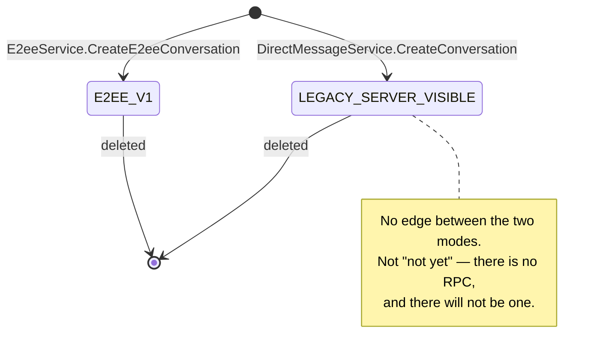
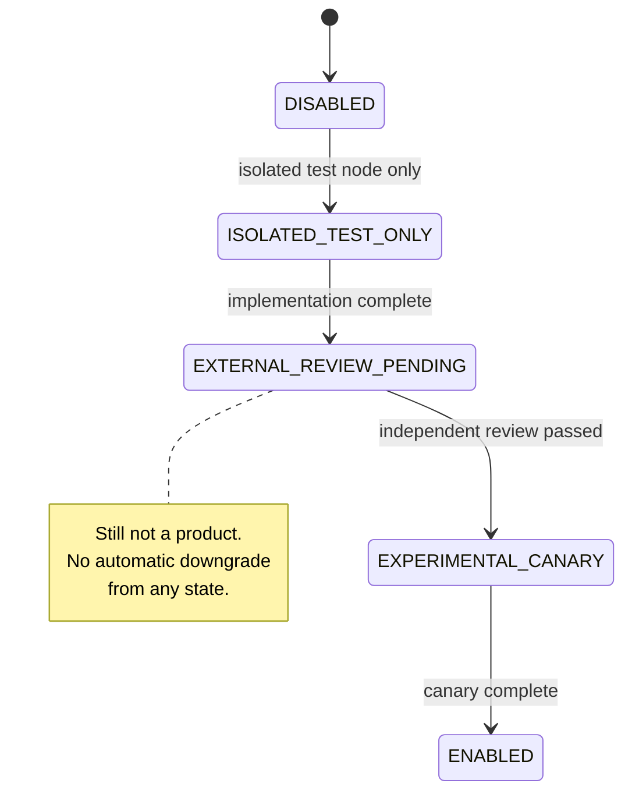

# End-to-end encrypted direct messages

**Status: protocol core and wire/domain contract implemented; no node implementation; independent
review pending; production capability `DISABLED`.**

[ADR 0020](../decisions/0020-e2ee-direct-messages.md) is binding. This document records the
boundary and the contract, not a claim that E2EE is available. `E2eeService` is **schema-only**:
`packages/proto/proto/patches/v1/e2ee.proto` defines every RPC, no `apps/server` controller
implements one, and a node answers all of them `UNIMPLEMENTED`.

Where to look:

| Layer               | Path                                                 |
| ------------------- | ---------------------------------------------------- |
| Wire contract       | `packages/proto/proto/patches/v1/e2ee.proto`         |
| Domain contract     | `packages/domain/src/e2ee/`                          |
| Primitives, ratchet | `packages/crypto/` (see its `README.md`)             |
| Persistence         | `packages/database/src/entities/` (`e2ee*`, P13-002) |
| Decision of record  | `docs/decisions/0020-e2ee-direct-messages.md`        |
| Audit of the spike  | `docs/research/e2ee-dms.md`                          |

## 1. Conversation modes

| Mode                    | Node body access                                     | Mutation / fallback |
| ----------------------- | ---------------------------------------------------- | ------------------- |
| `LEGACY_SERVER_VISIBLE` | The node stores and can read the existing plaintext. | Immutable.          |
| `E2EE_V1`               | The node routes opaque ciphertext and metadata only. | Immutable.          |

The mode is fixed at creation and there is no transition RPC in any schema. Legacy history is never
relabelled, copied into an encrypted conversation as if it had always been protected, or upgraded in
place — the node has already read it, and re-encrypting it would be a false claim. An E2EE send
fails when the capability or any active participant device is unavailable; it never falls back to
plaintext, and a client that cannot speak the protocol cannot join or render the conversation.

`packages/domain/src/e2ee/modes.ts` pins the immutable modes, the rollout states, the
8-member/8-device fanout bound, the 100 one-time-prekey target, the seven-day signed-prekey
rotation, the ten-message report-context limit, and the no-downgrade negotiation rule.



## 2. Identity: root, devices, roster

Three signed objects, each verified by the client rather than asserted by the node.

1. **Messaging identity root** — a long-lived Ed25519 key, separate from every login credential,
   whose public key is the stable input to the actor's safety number. It self-signs its own
   transcript (proof of possession); a rotation may additionally be signed by the previous root.
2. **Device certificate** — the root's signature over a canonical transcript binding actor id,
   device id, the device's Ed25519 **signing** key, its X25519 **agreement** key, validity window,
   protocol capabilities, and version. This binding is the fix for the spike's critical finding
   (`docs/research/e2ee-dms.md` §4.1): unbound signing and agreement identities let an attacker
   present their own agreement key while naming someone else's signing identity.
3. **Device roster** — an append-only, root-signed hash chain of the account's devices, sequence
   starting at 1 and advancing by exactly 1, each link naming the previous link's digest.

`packages/domain/src/e2ee/roster.ts` rejects, by name, every way a node could rewrite device
history: a sequence gap or repeat, a `previous_digest` that does not chain, a decreasing root
generation, a device dropped rather than marked inactive, a device id re-pointed at a new
certificate, an un-revocation, and a served sequence below one the client already verified.

```mermaid
sequenceDiagram
    participant D as New device
    participant R as Identity-authority device
    participant N as Node
    participant P as Peer client
    D->>R: device id + signing pk + agreement pk
    R->>R: sign device certificate; append roster n+1
    R->>N: EnrollDevice(certificate, roster n+1, prekeys)
    N->>N: verify chain: n+1, prev digest, root signature
    P->>N: ListDeviceRosters(after: last verified sequence)
    N-->>P: roster log n..n+1
    P->>P: verify every link locally
    P->>P: identity change? pause sends, require re-verification
```

A malicious node can still refuse to serve a roster or serve a stale one. It cannot forge one, and
a client that verifies forward from its last known sequence detects a rollback or a split view.
Safety-number comparison over an out-of-band channel remains the authentication control for first
contact and for any identity change — both `PLANNED_ROTATION` and `UNVERIFIED_RESET` pause sends and
invalidate prior verification. There is deliberately no "trusted automatically" outcome.

## 3. Sending: prekeys, sessions, fanout

```mermaid
sequenceDiagram
    participant S as Sender device
    participant N as Node
    participant Rx as Each recipient device
    S->>N: GetE2eeConversationState(conversation)
    N-->>S: membership epoch, members, rosters
    S->>S: verify rosters, certificates, active devices
    S->>N: ClaimPrekeyBundles(devices without a session)
    N->>N: atomically consume ≤1 one-time prekey per device
    N-->>S: bundles (or exhausted → signed prekey only)
    S->>S: X3DH-class setup; Double Ratchet per device
    S->>N: SendEnvelopes(logical message, all device envelopes)
    N->>N: recompute fanout digest; check exact coverage; check epoch
    N-->>S: franking tag
    Rx->>N: ListMailboxEnvelopes(cursor)
    N-->>Rx: envelopes, oldest first
    Rx->>Rx: decrypt, verify franking, durably commit
    Rx->>N: AcknowledgeEnvelopes
```

The fanout is **atomic and exact**. The set of `(actor, device)` pairs in a send must equal the set
of currently active devices of every current member — including the sender's own other devices, so
sent history reaches them. Missing targets are a silent exclusion; extra targets are delivery to a
device nobody's root certified. Both are rejected. The sender commits to the set with
`fanout_digest` over a canonical, length-prefixed transcript
(`packages/domain/src/e2ee/envelopes.ts`), and the node and every recipient recompute it, which is
what makes a dropped envelope detectable rather than merely unlikely.

A message composed under a stale membership epoch is rejected rather than delivered — the case that
matters is a message in flight when someone leaves a group.

One-time prekey exhaustion is a normal, signalled state, not a failure: the node reports remaining
counts to the owning device only (another actor's count is an availability oracle), the device
replenishes below the threshold, and a claim against an exhausted inventory falls back to the signed
prekey with reduced forward secrecy for that first message, exactly as X3DH describes.

Mailbox reads are keyset-paginated on `(received_at, envelope_id)` ascending, strictly after the
cursor. There is no offset, no page number, and no `sort`/`order` parameter anywhere in the schema —
spec §153 and Amendment B (§194). A mailbox has exactly one order: oldest first.

## 4. What the node stores, and what it must never see

| The node holds                                                | The node never receives                      |
| ------------------------------------------------------------- | -------------------------------------------- |
| Conversation membership, `security_mode`, membership epoch    | E2EE message plaintext (except §5 evidence)  |
| Public identity roots, device certificates, roster log        | Message keys, chain keys, root keys          |
| Public prekey bundles and inventory counts                    | Ratchet state, skipped-key stores            |
| Opaque `encrypted_header`, `ciphertext`, `opening_ciphertext` | Device private keys                          |
| Ciphertext and fanout digests, franking commitments           | Recovery keys or an escrowed decryption key  |
| Its own franking tag and key era                              | The franking _opening_ for any message       |
| Sender/recipient device ids, accepted/received timestamps     | Anything that would let it open a commitment |

The node additionally learns coarse ciphertext size, prekey inventory movement, mailbox fetch
patterns, and ordinary network/request metadata. Product copy must state that metadata exposure
plainly and must not call the mode metadata-private.

No job, outbox row, notification, backup, analytics event, search index, exception payload, trace,
metric, or moderator view may carry an E2EE body. Notifications carry a generic new-message signal
and a conversation identifier — nothing else.

## 5. Franking and reporter-disclosed evidence

Franking is what keeps abuse reports actionable when the node cannot read the conversation. It has
two halves, and conflating them is the classic mistake:

- a **sender commitment** to the plaintext, hidden from the node, whose opening is sealed to each
  recipient — so a recipient, and only a recipient, can later prove what was sent; and
- the **node's own symmetric tag** over the metadata transcript it accepted, which proves to _this
  node_ that it routed this content under this metadata.

The node's tag is symmetric, node-keyed, and therefore forgeable by the node itself. That is the
point: a public per-message signature would turn every message into a transferable, non-repudiable
receipt and destroy the deniability franking preserves. Franking answers "did this node accept
this?" — never "can a third party prove this person said it?"

```mermaid
sequenceDiagram
    participant U as Reporter
    participant C as Reporter's client
    participant N as Node
    participant M as Moderator
    U->>C: report this message
    C->>U: show exactly what will be disclosed
    U->>C: explicit consent
    C->>N: ModerationService.CreateReport
    C->>N: AttachReportEvidence(report, ≤11 items, consent=true)
    N->>N: verify commitment openings + own tag; stamp consented_at
    N-->>C: VERIFIED | UNVERIFIABLE(code)
    N->>M: evidence + "partial context, not transferable proof"
```

Rules the implementation must keep, all enforced in `packages/domain/src/e2ee/franking.ts`:

- **Consent is a positive act**, checked before anything is read, and the node — not the client —
  stamps `consented_at`. A client that could backdate consent could manufacture a record of a
  disclosure the user was never shown.
- **The disclosure is bounded**: the reported message plus at most ten surrounding ones. Without the
  bound, "report with context" is an unbounded plaintext-extraction channel.
- **Failure is `UNVERIFIABLE`, never discarded.** A failed franking check means the node cannot
  vouch for the bytes — not that the report is false. The report is queued either way. A failed
  technical check is not a finding of innocence.
- **Failure codes are a closed set** (`COMMITMENT_MISMATCH`, `NODE_TAG_MISMATCH`,
  `UNKNOWN_FRANKING_PROFILE`, `UNKNOWN_KEY_ERA`, `TRANSCRIPT_MISMATCH`). No free-form reason string,
  because that is where a fragment of disclosed plaintext eventually leaks into a log line.
- **Evidence is never logged, traced, metered, or put in an error payload**, and is subject to
  report-level access control and report retention.
- **The moderator surface must say what the evidence is not.** `E2EE_FRANKING_MODERATOR_DISCLOSURE`
  is the required sentence: reporter-selected context is not the whole context, and the tag is not
  proof to anyone outside this node.

`E2EE_APPROVED_FRANKING_PROFILES` in `packages/domain/src/e2ee/modes.ts` is deliberately **empty**.
It is ADR 0020 §12.7's independent-review gate in mechanical form: no profile can be operated in
production until a reviewed construction is added to that list, and adding one requires amending the
ADR rather than editing a constant in a feature branch.

## 6. What clients must say

Spec §183.1 and §194 are not style guidance. `packages/domain/src/e2ee/modes.ts` exposes both rules
as functions so no client re-derives them:

| Mode                    | `mayDescribeAsEndToEndEncrypted` | Required disclosure (`requiredConversationDisclosure`)                                                 |
| ----------------------- | -------------------------------- | ------------------------------------------------------------------------------------------------------ |
| `LEGACY_SERVER_VISIBLE` | `false`                          | "Not end-to-end encrypted — this node's operators can read these messages."                            |
| `E2EE_V1`               | `true`                           | "End-to-end encrypted. This node cannot read these messages, but it can see who you message and when." |

The words _encrypted_, _end-to-end_, _secure_, and _private_ are forbidden for anything but
`E2EE_V1` — with no "mostly", "soon", or "effectively" qualifier. Both modes have something the user
has to be told, which is why the disclosure is text rather than a boolean: legacy is readable by the
operator, and E2EE still exposes routing metadata. Neither may be shortened to "private".

Clients read the mode from `Conversation.security_mode` on the wire, never from a local assumption
about which screen they are on.

Additional client obligations: pause sends and require re-verification on any identity change;
surface safety numbers; never present a franking tag as third-party proof; and state plainly that
revocation cannot retract what a device already holds and is never a remote wipe.

## 7. Rollout states



The production capability is `DISABLED`. `ISOLATED_TEST_ONLY` is valid only on an explicitly
isolated test node. `EXPERIMENTAL_CANARY` and `ENABLED` are post-review states and must not be
selected until ADR 0020 §12's automated gates and P13-014's independent review and remediation are
complete. Enabling the capability never downgrades an existing conversation, and disabling it never
converts one — a node that turns E2EE off still offers legacy DMs to everyone, because DMs are a
**function** and §184.3 forbids capability-gating a function.

## 8. Cryptographic boundary

`@patches/crypto` implements certified account-root/device identities, signed monotonic roster
digests, transcript-bound X3DH-class setup, and Signal's revision-4 Double Ratchet encrypted-header
profile. Its sources and state-commit contract are documented in `packages/crypto/README.md`.

`@patches/domain` deliberately depends on no crypto library. Signature verification, digests, and
franking checks are injected interfaces (`SignatureVerifier`, `DigestFunction`, `FrankingVerifier`),
so the TUI, the server, and the worker all run _the same_ validators. A rule enforced in one place
is a rule; a rule re-derived in three clients is three chances to get it wrong.

Protocol signature verification uses strict RFC 8032 semantics, not noble's default ZIP-215 mode,
which accepts non-canonical encodings and small-order points. The implementation uses Noble 2.3.0
primitives; that is not an audit of Patches' composition. JavaScript cannot guarantee constant-time
execution or complete zeroization, so wiping is best-effort. Cross-client vectors and independent
security review and remediation remain hard ship gates.

## 9. Federation is a non-goal here

ADR 0020 §13 authorizes **local-node E2EE only**. No key, prekey, envelope, roster, report, or DM
delivery path may cross `FederationGateway` or ActivityPub, even when public federation is enabled
for other content. Federated key discovery, cross-node envelopes, and remote moderation evidence are
out of scope and need separate owner sign-off, a threat model spanning independently operated nodes,
and a new ADR. See [`federation.md`](./federation.md).
