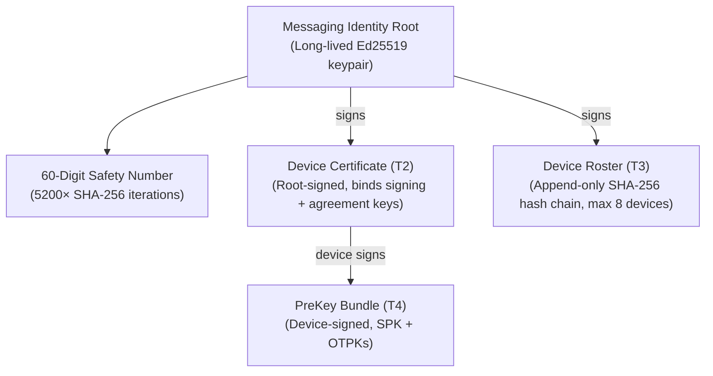

# Patches — Deep-Dive Project Review

> Four research agents independently explored the codebase, spec, ADRs, and implementation. This synthesizes their findings.

---

## 🔐 How E2EE Encryption Works

Patches has undergone a **major architectural evolution** on DMs:

| Phase                                 | What happened                                                                                                                                                                             |
| ------------------------------------- | ----------------------------------------------------------------------------------------------------------------------------------------------------------------------------------------- |
| **Phase 11** (original spec §183.1)   | DMs were **server-visible plaintext** — stored in Postgres, protected only by TLS + disk encryption. Every client had to display _"Not end-to-end encrypted — operators can read these."_ |
| **Phase 13** (ADR 0020/0024/0025)     | Full E2EE (`E2EE_V1`) designed from scratch — Signal X3DH + Double Ratchet rev-4 with encrypted headers + HMAC-based message franking.                                                    |
| **Pre-Alpha** (ADR 0030)              | Legacy server-visible mode **completely deleted**. Enum value `LEGACY_SERVER_VISIBLE = 1` permanently reserved. All plaintext RPCs removed.                                               |
| **Current** (ADR 0033/0035/0036/0037) | **All conversations are strictly `E2EE_V1`.** The server is an untrusted router of opaque ciphertext.                                                                                     |

### Crypto Stack

Everything runs on `@noble/curves`, `@noble/ciphers`, `@noble/hashes` — **zero native deps**, identical across Node, browser, and React Native:

| Function              | Primitive                                      |
| --------------------- | ---------------------------------------------- |
| Key agreement         | **X25519** (RFC 7748)                          |
| Signatures            | **Ed25519** (RFC 8032, strict `zip215: false`) |
| Payload & header AEAD | **XChaCha20-Poly1305** (24-byte nonce)         |
| KDF                   | **HKDF-SHA256** (RFC 5869)                     |
| MAC / ratchet chains  | **HMAC-SHA256**                                |
| Vault KDF             | **Argon2id** (`m=19456 KiB, t=2, p=1`)         |
| Key wiping            | Best-effort zeroization via noble `clean()`    |

### Identity Hierarchy



- **Root key** is account-level, minted on the primary device, completely separate from login credentials
- **Device certificates** bind a device's Ed25519 signing key + X25519 agreement key — closing the split-identity substitution attack the original spike had
- **Device roster** is a monotonic append-only hash chain (tamper-evident, max 8 active devices)
- **Device linking** uses out-of-band **Short Authentication Strings** (20-digit SAS, 5 groups of 4 digits) — no root private key export needed

### X3DH Key Exchange

Standard Signal X3DH (Revision 1) adapted for certified split signing/agreement identities:

1. **4 DH computations** (3 mandatory + 1 if one-time prekey available)
2. **IKM** = `0xFF×32 || DH1 || DH2 || DH3 [|| DH4]`
3. **HKDF-SHA256** derives `rootKey` (32B) + `initiatorHeaderKey` (32B) + `responderHeaderKey` (32B)
4. Initial messages carry a **`PESH` magic** (`0x50 0x45 0x53 0x48`) setup block so the receiver can distinguish bootstrap from ratchet messages

### Double Ratchet

Signal Double Ratchet **Revision 4 with Section 4 Encrypted Headers**:

- DH ratchet advances with fresh X25519 keypairs per round
- Symmetric chains step via `HMAC-SHA256(chainKey, 0x01)` → messageKey, `HMAC-SHA256(chainKey, 0x02)` → nextChainKey
- **Headers are encrypted** (XChaCha20-Poly1305) — the server cannot see sequence numbers, message counts, or ratchet boundaries
- Bounded skipped-key cache (max 2,000)
- State transitions are **functional** (`RatchetTransition<T>`) and serialized into the client's encrypted vault

### Message Franking (Abuse Reporting Without Breaking E2EE)

This is the clever part — ADR 0025 implements **HMAC-based committing AEAD** so recipients can prove message content to moderators without giving the server ongoing plaintext access:

1. **Sender** generates random `openingKey`, computes `frankingCommitment = HMAC(openingKey, context || plaintext)`, then seals the `openingKey` + plaintext inside the AEAD ciphertext with the commitment bound in the associated data
2. **Server** generates a symmetric `frankingTag = HMAC(nodeFrankingKey, reportTranscript)` — this is **deniable** (the server could forge it, so it only proves to _itself_ that it accepted the message)
3. **Recipient** decrypts and **must** verify the franking commitment before seeing plaintext (enforced by API design — `openDeviceEnvelope()` is the only way to get plaintext)
4. **On abuse report**: recipient discloses `openingKey` + plaintext → server verifies commitment against stored envelope digests

### Client Key Storage

| Platform          | Vault wrapping                                                                                         |
| ----------------- | ------------------------------------------------------------------------------------------------------ |
| Desktop/CLI (TUI) | **OS Keyring** (`@napi-rs/keyring` — macOS Keychain, Linux Secret Service, Windows Credential Manager) |
| Fallback          | **Argon2id passphrase KDF** → XChaCha20-Poly1305 wrapped master key                                    |
| Opt-in insecure   | `--allow-insecure-credential-file` → `0600` permissions file                                           |
| Web               | **WebCrypto + localStorage** (explicitly disclosed as vulnerable to origin XSS)                        |

> [!IMPORTANT]
> The server **never holds or generates** private keys, ratchet states, or message bodies. It stores only opaque ciphertext, routing metadata, and coarse ciphertext size buckets.

---

## 🌐 How Federation Works

**It's ActivityPub** — not AT Protocol, not Nostr, not a custom protocol. Standard W3C Fediverse.

### Protocol Stack

| Layer              | Implementation                                                                                                  |
| ------------------ | --------------------------------------------------------------------------------------------------------------- |
| Identity discovery | **WebFinger** (RFC 7033) — `GET /.well-known/webfinger?resource=acct:handle@domain`                             |
| Social protocol    | **ActivityPub** (W3C Recommendation) with ActivityStreams 2.0                                                   |
| HTTP auth          | **HTTP Signatures** (`draft-cavage-12`) with RSA-2048 SPKI PEMs                                                 |
| Security           | **SSRF protection** (`safeFetch` — IP pinning, private range rejection, 10s timeout, 1MB max, 3 redirect limit) |

### Gateway Seam Pattern

Domain services never touch ActivityPub JSON directly. Instead, there's a clean **`FederationGateway` interface** ([federation-gateway.ts](file:///home/allie/develop/patches/apps/server/src/modules/federation/federation-gateway.ts)):

```
PostService / SocialGraphService / ReactionService
        ↓ calls gateway methods
FederationGateway (interface)
    ├── NoopFederationGateway     ← FEDERATION_ENABLED=false (default)
    ├── ActivityPubFederationGateway  ← resolves inboxes, builds AS2, enqueues outbox
    └── LazyFederationGateway     ← dynamic dispatch per-call (for testing)
```

### Delivery Pipeline

Deliveries are **never synchronous** in the request cycle:

1. Domain event fires → gateway enqueues `FEDERATION_DELIVER` job in `outbox_jobs` table **within the same DB transaction**
2. Worker picks up job via `SELECT ... FOR UPDATE SKIP LOCKED`
3. Worker re-checks `domain_blocks`, decrypts signing key (AES-256-GCM at rest), signs HTTP request, delivers via `safeFetch`
4. Retry: up to **12 attempts** with exponential backoff. Terminal HTTP errors (400/401/403/404/410/422) fail fast.

### What's Implemented (Behind `FEDERATION_ENABLED` Flag)

- ✅ WebFinger endpoint
- ✅ Actor document serialization with RSA key + `patches:pageManifest` extension
- ✅ Inbox processing: `Follow`, `Accept`, `Undo`, `Create(Note)`, `Update(Note/Actor)`, `Delete(Tombstone)`, `Like`, `Announce`
- ✅ Outbox collection with keyset pagination
- ✅ Reposts as `Announce` / `Undo(Announce)` with deterministic URI reconstruction
- ✅ Hashtags as `as:Hashtag` extension
- ✅ Quotes via **FEP-044f** (consent-respecting) + fallback parsing for Fedibird (`quoteUri`), ActivityStreams (`quoteUrl`), and Misskey (`_misskey_quote`)
- ✅ Domain blocking with admin CLI + transparency RPCs
- ✅ Activity deduplication, peer rate limiting
- ✅ Two-node integration test lab

### What's Not Yet Built

| Stage                             | Target         | Status                                                                  |
| --------------------------------- | -------------- | ----------------------------------------------------------------------- |
| **F0** — Schema readiness         | ✅ Shipped     | Local/remote actor+post distinction, canonical URIs, tombstones         |
| **F1** — Two-node lab             | ✅ Implemented | Loopback testing, default `FEDERATION_ENABLED=false`                    |
| **F2** — Interop (v0.3–0.4)       | ❌ Not started | Mastodon/Pixelfed interop, identity migration (`movedTo`/`alsoKnownAs`) |
| **F3** — Public federation (v1.0) | ❌ Not started | Public internet federation after stable canonical domain                |

### Hard Federation Boundaries

- **E2EE/DMs never cross federation** (§194, ADR 0020 §13, ADR 0028 §2) — tested by `federation-isolation.test.ts`
- **Communities stay local-only in v0** (§182.1)
- **No ranking signals cross federation** — chronological ordering only

---

## 💚 Things I Like About This Project

### 1. The Philosophy Is Uncompromising and Genuine

The spec isn't hand-wavy. §153 explicitly bans engagement ranking, §184.3 bans paywalled function, Amendment B bans votes/karma/scores/trending. This isn't "we'll add algorithmic feeds later" — it's a structural commitment to chronological, user-controlled timelines. The codebase enforces it: there is literally no `rankHomeFeed()`, no `sort`/`order` parameter on any timeline RPC.

### 2. The Crypto Is Real, Not Toy

This isn't "we use AES" hand-waving. It's a proper Signal-grade protocol with:

- Formal Double Ratchet rev-4 with **encrypted headers** (most implementations skip this)
- Certified X3DH with split signing/agreement identities (closing a real vulnerability)
- Message franking that enables abuse reporting without breaking E2EE
- Identity transcripts with monotonic hash-chained device rosters
- Zeroization of sensitive memory
- **Deterministic test vectors** for every crypto primitive

### 3. The Dual-Transport Bridge Is Elegant

gRPC for internal services and TUI; Connect-over-HTTP for browsers and mobile — all converging on a single server implementation. No transport fragmentation, no maintaining two API surfaces.

### 4. Terminal-First Is Actually Terminal-First

The TUI isn't an afterthought CLI wrapper. It has:

- Vim keybindings, command palette, split panes, responsive layouts
- Kitty graphics protocol with graceful degradation (half-block → braille → ASCII)
- A full theme engine with 6 built-in themes + custom JSON themes
- 55 screens covering every feature the web app has (and some it doesn't)

### 5. The Outbox Pattern Is Production-Grade

`SELECT ... FOR UPDATE SKIP LOCKED`, exponential backoff, dead-lettering, circuit breakers, idempotency keys. This is how you do reliable async work without reaching for Redis/Kafka.

### 6. Living Documentation

38 ADRs with clear context/decision/consequences. Architecture docs. Operational runbooks. Learning logs. Research notes. A diagnostic redactor that scrubs auth tokens and DM bodies before storage. This is a project that takes its own documentation seriously.

### 7. Safety & Moderation Are First-Class

Literal-term server-evaluated content filters (no user-supplied regex — avoiding ReDoS), decentralized labelers, transparent anonymized moderation log, bounded appeals process. These are built into the architecture, not bolted on later.

---

## 🔴 Biggest Gaps

### 1. E2EE Peer Handshake Is Broken (B-124)

> [!CAUTION]
> This is the **single largest technical blocker** in the entire project.

The crypto-native identity encoder ([`packages/crypto/src/identity.ts`](file:///home/allie/develop/patches/packages/crypto/src/identity.ts)) and the node-canonical transcript encoder ([`apps/server/src/modules/e2ee/e2ee.codec.ts`](file:///home/allie/develop/patches/apps/server/src/modules/e2ee/e2ee.codec.ts)) encode prekeys and certificates differently. Client session bootstrap against a peer **fails closed**. This blocks:

- TUI E2EE runtime (B-101)
- Two-node E2EE interop lab (B-108)
- One-time prekey consumption (B-187)
- Shared `@patches/e2ee-client` extraction (B-197)
- Web E2EE decryption (O-002)

### 2. No Realtime / Streaming (O-004)

Everything is polling (5s–60s intervals). No server-streaming for timeline updates, DM delivery, or notifications. Users have to wait for polling ticks or hit manual refresh.

### 3. ~2,300 Lines of Duplicated E2EE Code (B-186)

[`apps/tui/src/e2ee/`](file:///home/allie/develop/patches/apps/tui/src/e2ee/) and [`apps/web/src/e2ee/`](file:///home/allie/develop/patches/apps/web/src/e2ee/) are near-verbatim copies of security-critical code (runtime sessions, enrollment, vault formatting). ADR 0034 outlines hoisting into `@patches/e2ee-client` but it's not done.

### 4. Web Client Page Blocks Are Placeholders

Gallery, TopEight, Friends, Guestbook, Posts, and Badges blocks render as stubs on web. TUI users get the full experience; web users don't.

### 5. Spec / Code Misalignment on DMs (B-125)

`INITIAL_VISION.md` §183 still mandates plaintext server-visible DMs as a hard rule. The code has fully moved to E2EE-only (ADR 0030). The spec needs an owner amendment to formalize this.

### 6. No Post-Quantum Crypto

Classical X25519/Ed25519 only. Protocol fields are versioned for future PQXDH (ML-KEM/Kyber) but nothing is implemented.

### 7. Mega-Files Need Decomposition

- [`apps/tui/src/app/App.tsx`](file:///home/allie/develop/patches/apps/tui/src/app/App.tsx) — ~123 KB, 2,800+ lines
- [`apps/server/src/modules/auth/auth.service.ts`](file:///home/allie/develop/patches/apps/server/src/modules/auth/auth.service.ts) — ~90 KB, 2,000+ lines (password + SSH + GitHub + OIDC + passkeys + device linking + recovery codes in one class)

---

## ⚡ Quickest Improvements

Ordered by effort (smallest first):

| #   | What                                                                                           | Effort   | Impact                                                 |
| --- | ---------------------------------------------------------------------------------------------- | -------- | ------------------------------------------------------ |
| 1   | **Enable VitePress site deploy** (B-205) — flip `SITE_DEPLOY_ENABLED=true` in GitHub Actions   | Minutes  | Public docs site goes live                             |
| 2   | **Set Fly secrets for GitHub login** (P15-001) — `flyctl secrets set GITHUB_CLIENT_ID=...`     | Minutes  | GitHub device-flow login works in production           |
| 3   | **Fix flaky web test parallelism** (B-127) — set `fileParallelism: false` in web vitest config | 30 min   | Eliminates intermittent CI failures                    |
| 4   | **Add post reporting to web timeline** — wire existing `ReportDialog` into `PostCard` menu     | 1–2 hrs  | Posts reportable from timeline, not just profile pages |
| 5   | **Add `GetCommunityByName` RPC** — handle/name lookup instead of UUID                          | 2–3 hrs  | `/c/dev` works instead of requiring UUIDs              |
| 6   | **Add `ListLabelerSubscriptions` RPC**                                                         | 2–3 hrs  | Settings pages can show active labeler subscriptions   |
| 7   | **Fix B-124 (E2EE transcript encoder mismatch)**                                               | 1–2 days | **Unblocks the entire E2EE feature tree**              |
| 8   | **Hoist E2EE client code** (ADR 0034)                                                          | 2–3 days | Eliminates 2,300 lines of dangerous duplication        |
| 9   | **Decompose `AuthService`** into sub-services                                                  | 2–3 days | Maintainability of the largest service file            |

> [!TIP]
> **If you do one thing**: fix B-124. It's a transcript encoding mismatch — bounded scope, likely a day of focused work — and it unblocks 5+ downstream tasks including the entire DM experience for real users.

---

## Overall Assessment

**Maturity: A / Production-Ready Pre-Alpha.** This is one of the most disciplined solo/small-team codebases I've seen. The architecture boundaries are clean, the crypto is serious, the spec is honest about tradeoffs, and the documentation is living. The main risk isn't quality — it's that the E2EE handshake blocker (B-124) is gating the entire messaging experience, and the duplicated client crypto code is a drift hazard on security-critical paths.
